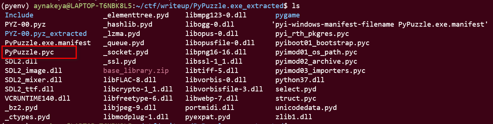

**Main concept: how to decompile pyinstaller program**

First, this is a typical pyinstaller program.


So first we need find the source code.


<!-- more -->

The source code is in `pypuzzle.pyc` and the python version is python3.7 according to `python37.dll` 



Due to bytecode header, using decompyle3 will show error.

So, in order to decompile, we need to bytecode header first.

1. unzip base_library.zip, open any file using hex editor
2. open [PyPuzzle.py](http://pypuzzle.py) suing hex editor

not that, the file in base_library contains bytecode header. which is `42 0D 0D 0A 01 00 00 00` for python 3.7


1. we need add ``42 0D 0D 0A 01 00 00 00`` to the [PyPuzzle.py](http://pypuzzle.py) file and remove extra 0s


1. save [PyPuzzle.py](http://pypuzzle.py) and decompile again.

```python
# uncompyle6 version 3.7.4
# Python bytecode 3.7 (3394)
# Decompiled from: Python 3.8.10 (default, Jun  2 2021, 10:49:15)
# [GCC 9.4.0]
# Embedded file name: PyPuzzle.py
# Compiled at: 1975-05-06 10:59:01

#....ignoreed
    while True:
        slideTo = None
        msg = 'Click tile or press arrow keys to slide.'
        if mainBoard == SOLVEDBOARD:
            msg = 'Solved! But Wait you need to decrypt the flag *_^'
            flag = '3blKlvIKqQoG0D6B4XDcZxQjbLbg4KVJQzbm8b'
#....ignoreed
```

use `ciphey` to get the flag. FU trendmicro.

